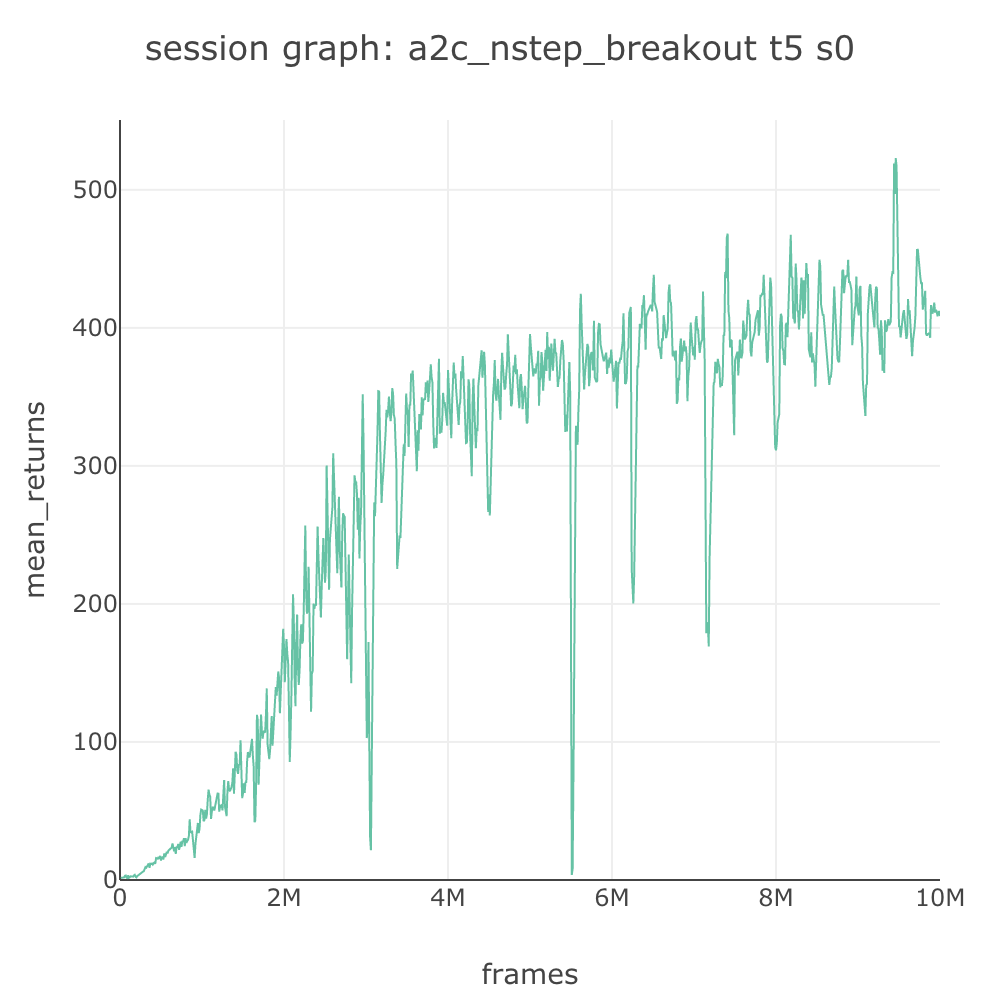
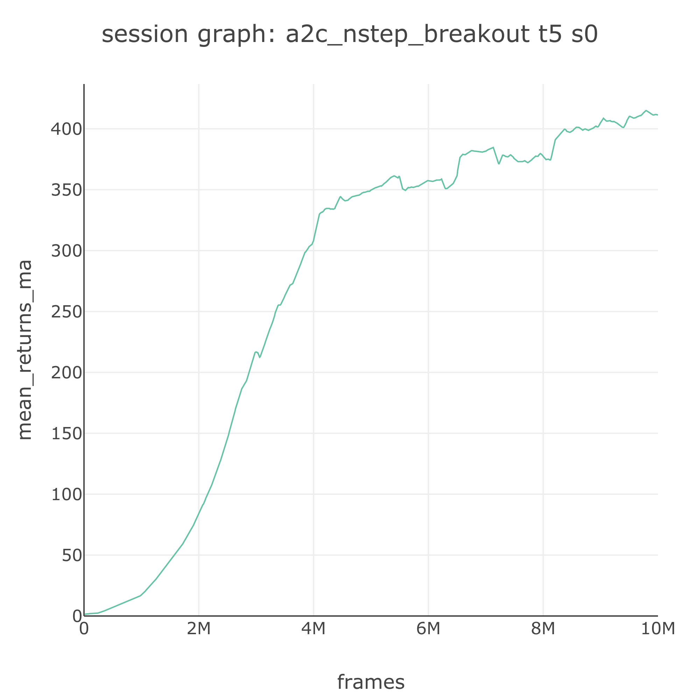
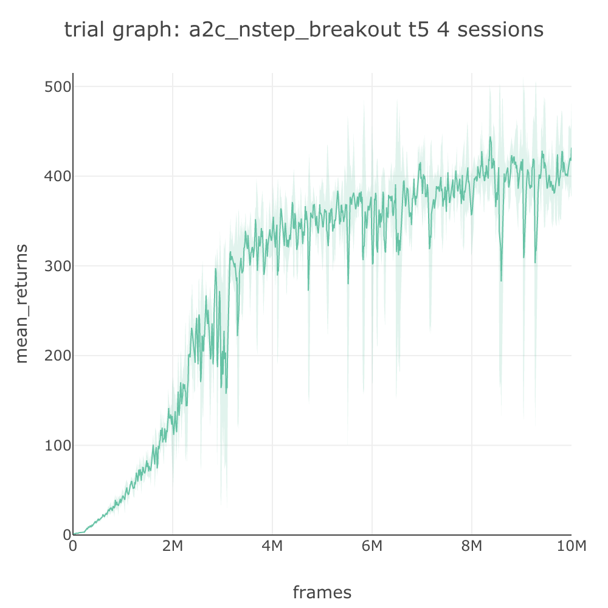
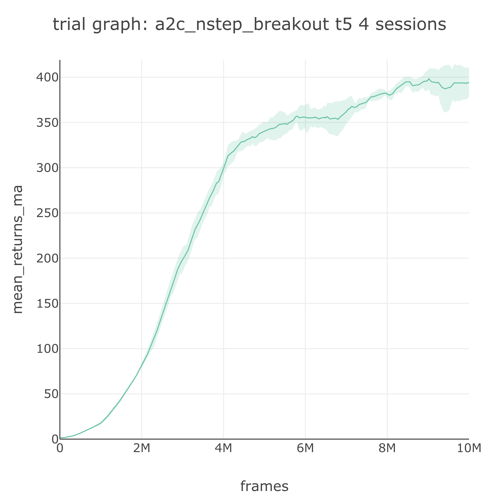
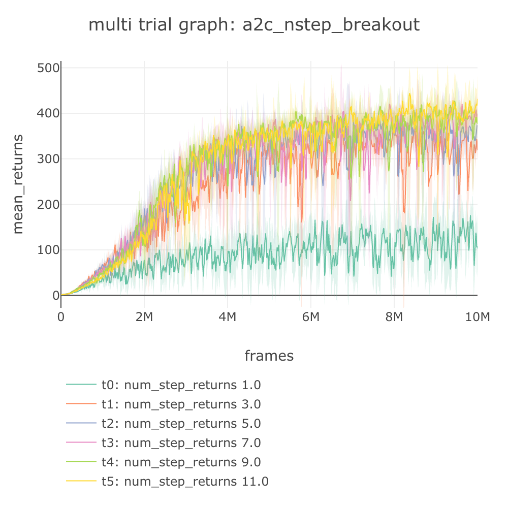
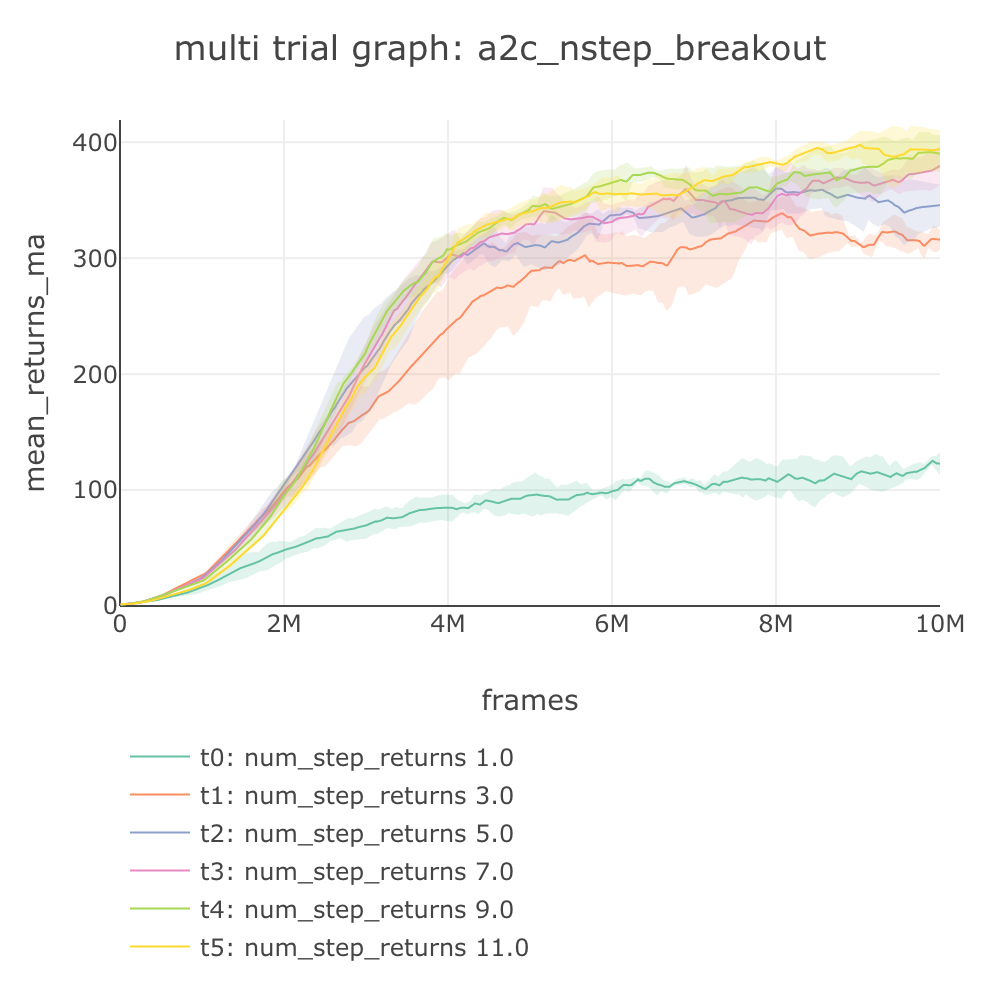
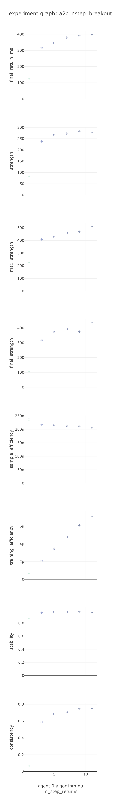

# Graphs and Data 📊

SLM Lab automatically generates graphs showing how your agent learns over time. These help you:

- **Track progress**: See if rewards are increasing
- **Compare runs**: Check if different random seeds give consistent results
- **Tune hyperparameters**: Compare different settings to find what works best

## Graph Types

SLM Lab produces graphs at each level of the [hierarchy](../using-slm-lab/lab-organization.md):

| Level | What It Shows | Use Case |
|-------|---------------|----------|
| **Session** | Single training run | Debug individual runs |
| **Trial** | Average of 4 sessions ± std | Report reliable results |
| **Experiment** | Multiple trials overlaid | Compare hyperparameters |

### Visual Comparison

|                                              Raw Graph                                              |                                              Moving Average                                             |
| :---------------------------------------------------------------------------------------------: | :-----------------------------------------------------------------------------------------------: |
|  |  |
|             |            |
|          |         |

**Row 1 - Session graphs**: Single training run. Noisy but shows real-time progress.

**Row 2 - Trial graphs**: Average across 4 sessions with error bands (±1 std). This is the standard format for reporting RL results—shows both performance and consistency.

**Row 3 - Experiment graphs**: Multiple trials overlaid for comparison. Each line is a different hyperparameter configuration.


The **moving average (MA)** graphs smooth the data using a 100-checkpoint window. These are easier to read and are typically used for publications.


## Reading the Graphs

### Axes

- **X-axis (frames)**: Total environment steps. With `num_envs=4`, 1M frames = 250K steps per env.
- **Y-axis (returns)**: Episode reward. Higher is better.

### Error Bands

Trial graphs show shaded regions representing ±1 standard deviation across sessions. Narrower bands = more consistent algorithm.

### What to Look For

| Pattern | Meaning |
|---------|---------|
| Steady upward trend | Algorithm is learning |
| Plateau | May need more training or hit environment limit |
| High variance | Consider more sessions or longer training |
| Collapse (sudden drop) | Possible policy collapse—use "best" checkpoint |

## Experiment Analysis

### Multi-Trial Graph

When running experiments (hyperparameter search), the multi-trial graph overlays all trials:


Each color represents a different hyperparameter configuration. This quickly shows which settings work best.

### Experiment Variable Graph

This graph plots **final performance vs. hyperparameter values**:



- **X-axis**: Hyperparameter value (e.g., lambda)
- **Y-axis**: Performance metric (e.g., strength)
- **Color**: Overall trial quality (darker = better)

This reveals relationships between hyperparameters and performance—useful for understanding algorithm sensitivity.

### Experiment DataFrame

The experiment data is also saved as `experiment_df.csv`:


Key features:
- **Sorted best-first**: Top row is the best configuration
- **All hyperparameters**: Shows what values were tried
- **All metrics**: Strength, efficiency, stability, consistency

```python
import pandas as pd

df = pd.read_csv('data/experiment_2026_01_30/info/experiment_df.csv')
print("Best configuration:")
print(df.iloc[0])
```

## Graph File Locations

After a run, find graphs in `data/{spec_name}_{timestamp}/graph/`:

```
graph/
├── *_session_graph_train_mean_returns_vs_frames.png      # Session raw
├── *_session_graph_train_mean_returns_ma_vs_frames.png   # Session MA
├── *_trial_graph_mean_returns_vs_frames.png              # Trial raw
├── *_trial_graph_mean_returns_ma_vs_frames.png           # Trial MA
├── *_multi_trial_graph_*.png                             # Experiment comparison
└── *_experiment_graph.png                                # Variable analysis
```

## Interactive Graphs

SLM Lab generates both PNG (static) and HTML (interactive) graphs using Plotly. The HTML versions support:

- **Zoom**: Click and drag to zoom into regions
- **Hover**: See exact values at any point
- **Pan**: Shift+drag to move around
- **Reset**: Double-click to reset view

Open the HTML files in any browser for interactive exploration.

## Advanced: Additional Graphs

The `graph/` folder also contains:

| Graph | What It Shows |
|-------|---------------|
| `*_loss_*.png` | Training loss over time |
| `*_lr_*.png` | Learning rate schedule |
| `*_explore_var_*.png` | Exploration parameter (epsilon, entropy) |
| `*_fps_*.png` | Training speed |

These are useful for debugging training issues.

## Regenerating Graphs

To regenerate graphs with updated styling:

```bash
uv run python -c 'from slm_lab.experiment import retro_analysis; retro_analysis.retro_analyze("data/ppo_lunar_2026_01_30_221924")'
```

This recomputes all derived data and graphs without re-running training.
