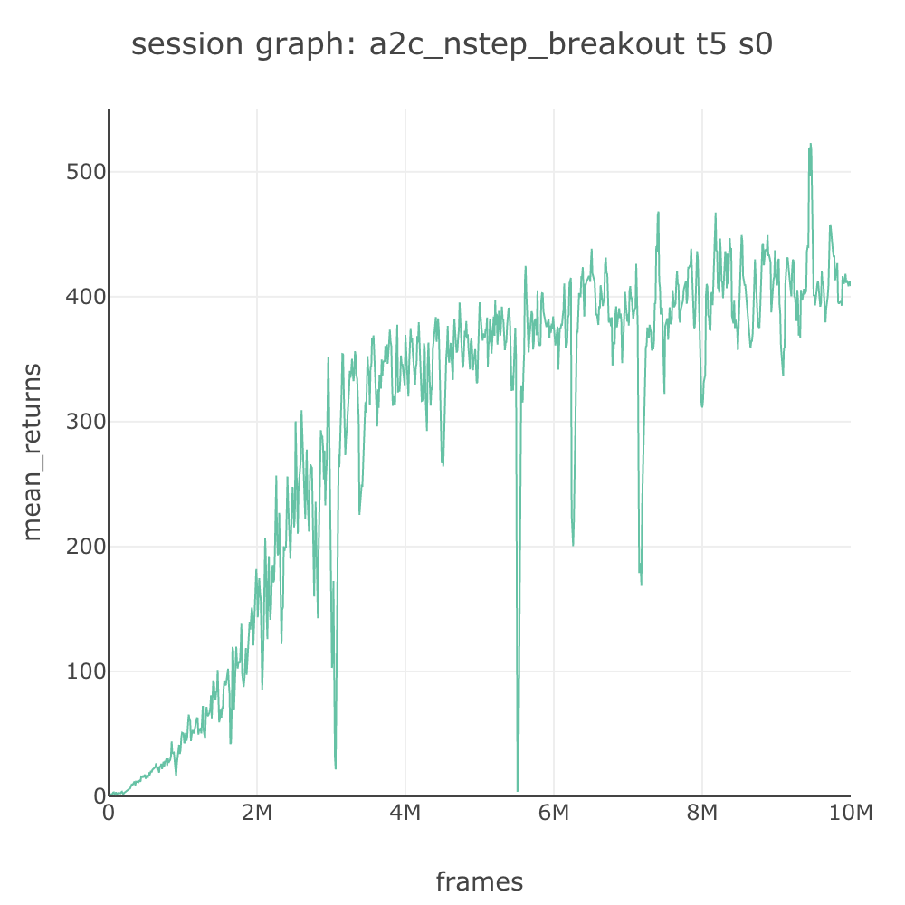
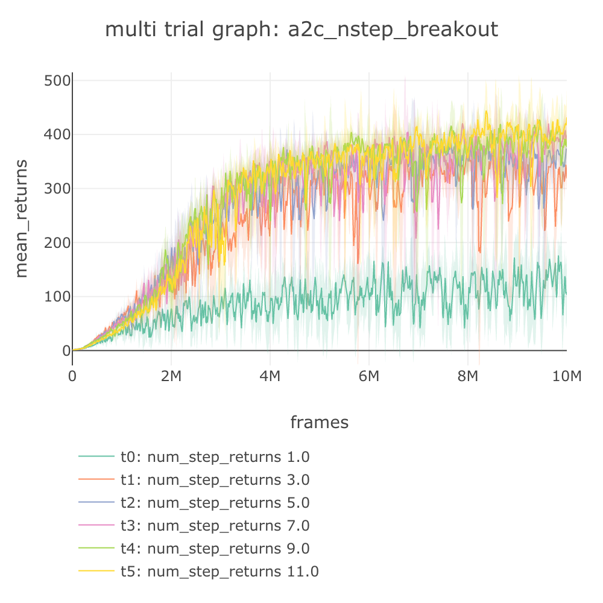

# Graphs and Data

## 📈 Session, Trial, and Experiment Graphs

As shown in [Lab Organization](../using-slm-lab/lab-organization.md), SLM Lab is organized into the hierarchy of Session, Trial and Experiment, with each higher level being a collection of its lower level. The graphs produced by each level, along with their moving average, are shown in the table below.

All the examples in this page is generated from an experiment using the spec file [slm\_lab/spec/experimental/a2c/a2c\_nstep\_n\_search.json](https://github.com/kengz/SLM-Lab/blob/master/slm_lab/spec/experimental/a2c/a2c_nstep_n_search.json), which is used to answer the question:

> What values of n of A2C n-step returns provide the fastest, most stable solution, if the other variables are held constant?

| Graph | MA Graph |
| :---: | :---: |
|  |  |
|  |  |
|  |  |

The first row shows the Session graphs. Session is the lowest level, running a single agent with an environment, with the total rewards checkpointed at specified frequency. It is common to smoothen the graph by taking the moving average with a window of 100 checkpoints.

The second row shows the Trial graphs. Trial is a collection of Sessions, and the Trial graph takes the Sessions' mean and plotting an error envelop using standard deviation. This is the most commonly seen deep RL graph as it helps visualize the averaged performance of an instance of a run, repeated over with multiple random seeds.

The last row shows the Experiment \(multi trial\) graph. An Experiment is a collection of Trials with varying hyperparameters designed to study a hypothesis, and this graph simply overlays the Trial graphs in the experiment for comparison.

## Experiment Variable Graph

Apart from the multi-trial graph, there is another experiment graph which plots **the final performance metrics vs. experiment variables** – the varied hyperparameter values. This helps us see the relationship between the metrics and the experiment variables more clearly. Continuing with the examples above, the experiment variable graph of these trials are plotted below \(to view it, download and zoom the graph\): 

The color of each dot represent the overall performance of the trial, the darker shade the better. Although only one variable \(n of n-step\) is shown here, if we have multiple variables in an experiment, this graph will contain more columns of subplots corresponding to the experiment variables.

## Experiment Dataframe

In fact, the experiment variable graph is plotted from the experiment dataframe, saved with suffix `experiment_df.csv`. An example of this is shown below:

This dataframe is another useful piece of output data; it sorts best-trials-first by their performance metric, so it can easily be used to read and find the best-performing trial. The experiment dataframe first lists the trial index, then the experiment variables, and finally a set of predefined metrics.

## Advanced Usage

More graphs are available in the `data/{spec_name}_{timestamp}/graph/` data folder produced from a run, including graphs of loss values, learning rate, etc. These are for more advanced users.

