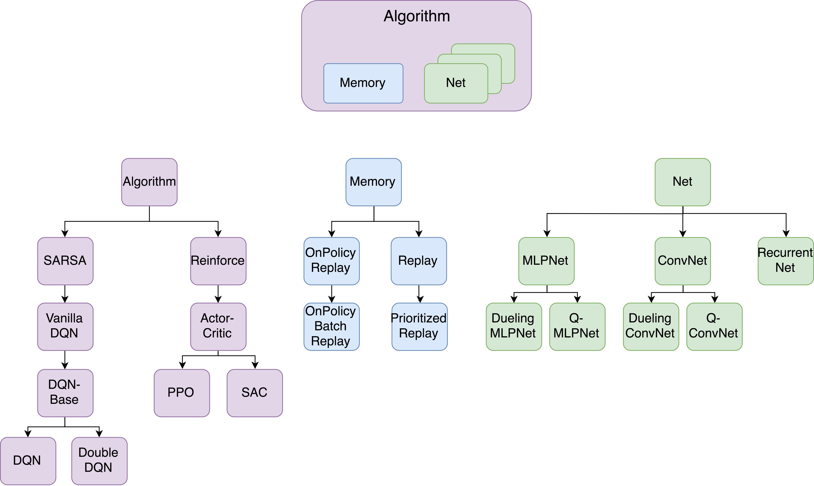

# Modular Design

## 📦 **Modular Design in SLM Lab**

Modularity is the central design choice in SLM Lab, as depicted in the figure below. Reinforcement learning algorithms in SLM Lab are built around three base classes:

* **Algorithm**: Handles interaction with the environment, implements an action policy, computes the algorithm-specific loss functions, and runs the training step.
* **Memory**: Provides the data storage and retrieval necessary for training.
* **Net**: Implements the deep networks that serve as the function approximators for an Algorithm.

The deep learning components in SLM Lab are implemented using PyTorch. The **Memory** and **Net** classes abstract data storage, data retrieval, and network training details, simplifying algorithm implementations. Furthermore, many Algorithm classes are natural extensions of each other.

Modular code is critical for deep RL research because many RL algorithms are extensions of other RL algorithms. If two RL algorithms differ in only a small way, but a researcher compares their performance by running a standalone implementation of each algorithm, they cannot know whether differences in algorithm performance are due to meaningful differences between the algorithms or merely due to quirks in the two implementations. [Henderson et al. \(2017\)](https://arxiv.org/abs/1709.06560) showcase this, demonstrating significant performance differences between different implementations of the same algorithm.

Modular code is also important for research progress. It makes it as simple as possible for a researcher to implement — and reliably evaluate — new RL algorithms. And for the student of RL, modular code is easier to read and learn from due to its brevity and organization into digestible components.

