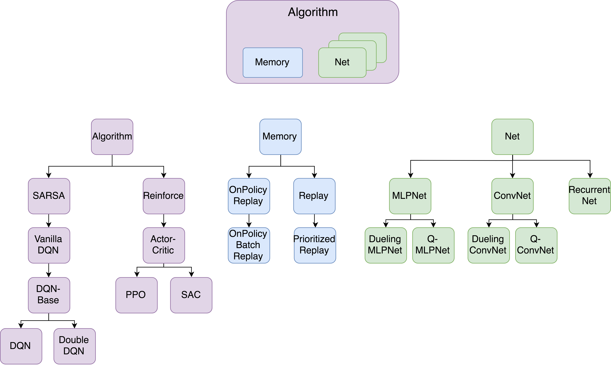

# Modular Design 🧩

## Why Modularity Matters

Deep RL research requires comparing algorithms fairly. If two implementations differ in subtle ways beyond the algorithm itself—network initialization, gradient clipping, learning rate schedules—performance differences become meaningless.

SLM Lab solves this with **modular design**: algorithms share the same base code, networks, memory, and training loops. When you compare PPO to A2C in SLM Lab, the *only* differences are the algorithmic ones.

**Benefits:**

| Benefit | How SLM Lab Achieves It |
|---------|-------------------------|
| **Fair comparison** | Algorithms share base classes; only algorithmic differences matter |
| **Code reuse** | New algorithms inherit tested components |
| **Fewer bugs** | Less code to review and maintain |
| **Easy extension** | Add new algorithms by overriding specific methods |

## Core Components

SLM Lab is built around three base classes:

```
Agent
 ├── Algorithm    Handles interaction with env, computes loss, runs training
 │    └── Net     Neural network function approximator
 └── Memory       Data storage and retrieval for training
```



### Algorithm

Implements the RL algorithm logic:
- Action selection (exploration vs exploitation)
- Loss computation (policy loss, value loss)
- Training step (gradient updates)

Key methods:
```python
act(state) → action           # Select action
train() → loss                # Update networks
update() → explore_var        # Update exploration
```

### Memory

Handles experience storage:
- Store transitions `(s, a, r, s', done)`
- Sample batches for training
- Signal when it's time to train

Types:
- `Replay` - Off-policy ring buffer
- `PrioritizedReplay` - Priority-based sampling
- `OnPolicyBatchReplay` - On-policy with fixed batch size

### Net

Neural network architectures:
- Configurable hidden layers and activations
- Automatic input/output sizing
- Optimizer and scheduler management

Types:
- `MLPNet` - Fully connected layers
- `ConvNet` - Convolutional + fully connected
- `RecurrentNet` - LSTM/GRU for sequences

## Inheritance in Action

Consider how algorithms are related:

```
ActorCritic (base actor-critic)
 ├── A2C (adds n-step returns)
 ├── PPO (adds clipped objective)
 └── SAC (adds entropy regularization)
```

PPO inherits from ActorCritic and only overrides:

1. **`init_algorithm_params()`** - Add PPO-specific hyperparameters
2. **`init_nets()`** - Add old_net for ratio computation
3. **`calc_policy_loss()`** - Implement clipped surrogate objective
4. **`train()`** - Multi-epoch minibatch training

Everything else—value function computation, advantage estimation, network initialization—is inherited from ActorCritic.

**Result:** PPO is ~280 lines of code instead of thousands for a standalone implementation.

See [Class Inheritance: A2C > PPO](class-inheritance-a2c-greater-than-ppo.md) for the detailed walkthrough.

## Composability

Components can be mixed and matched via the spec file:

```javascript
{
  "agent": {
    "algorithm": {"name": "DQN"},        // Any algorithm
    "memory": {"name": "PrioritizedReplay"},  // Any compatible memory
    "net": {"type": "RecurrentNet"}      // Any network
  }
}
```

**Example compositions:**

| Combination | What It Creates |
|-------------|-----------------|
| DQN + Replay + MLPNet | Standard DQN |
| DoubleDQN + PrioritizedReplay + MLPNet | DDQN+PER |
| DQN + Replay + RecurrentNet | DRQN (recurrent DQN) |
| PPO + OnPolicyBatchReplay + ConvNet | PPO for Atari |

## Why This Design?

[Henderson et al. (2017)](https://arxiv.org/abs/1709.06560) showed that implementation details dramatically affect RL results. Two "correct" implementations of the same algorithm can have vastly different performance due to:

- Random seed selection
- Network initialization
- Hyperparameter defaults
- Gradient clipping values
- Frame preprocessing

SLM Lab addresses this by:

1. **Shared base code** - Algorithms inherit common functionality
2. **Explicit configuration** - All hyperparameters in spec files
3. **Reproducibility** - Spec + git SHA fully defines an experiment
4. **Benchmarking** - Validated implementations with published results

## Extending SLM Lab

To add a new algorithm:

```python
# slm_lab/agent/algorithm/my_algo.py
from slm_lab.agent.algorithm.actor_critic import ActorCritic

class MyAlgorithm(ActorCritic):
    def init_algorithm_params(self):
        super().init_algorithm_params()
        # Add your parameters
        self.my_param = self.algorithm_spec.get('my_param', 0.5)

    def calc_policy_loss(self, batch, pdparams, advs):
        # Your custom policy loss
        return custom_loss
```

Then register in `slm_lab/agent/algorithm/__init__.py` and create a spec file.

## Further Reading

- [Algorithm Taxonomy](algorithm-taxonomy.md) - Visual overview of algorithm relationships
- [Class Inheritance: A2C > PPO](class-inheritance-a2c-greater-than-ppo.md) - Detailed code comparison
- [Architecture](../architecture.md) - Full system design
