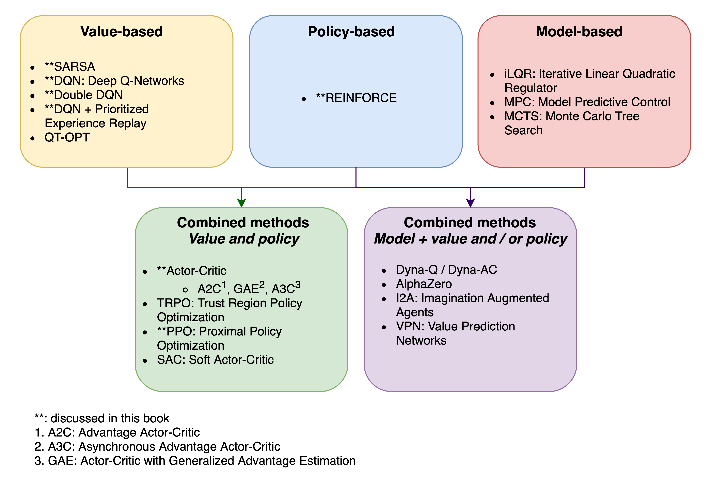
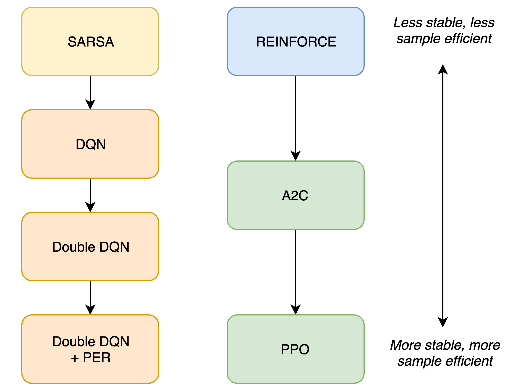

# Algorithm Taxonomy

## 🌿 Algorithm Taxonomy

Deep RL algorithms can be classified into a family tree based on their methods / functions they learn, such as the one shown below.

Algorithms often extends an existing one by modifying or adding components. Most model-free algorithms are descended from SARSA and REINFORCE. The figure below shows some of the algorithms in SLM Lab, and their relationships.

Naturally, implementations can be consistent with this theoretical taxonomy by using **class inheritance** and **modular components**. This is precisely what SLM Lab does.

