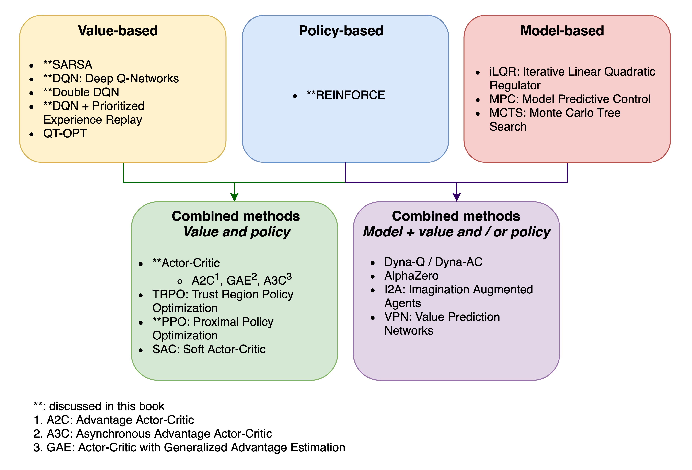
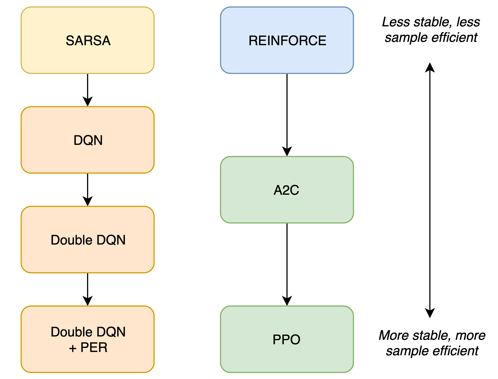

# Algorithm Taxonomy 🌳

## Algorithm Family Tree

Deep RL algorithms can be classified into a family tree based on their methods / functions they learn, such as the one shown below.

Algorithms often extends an existing one by modifying or adding components. Most model-free algorithms are descended from SARSA and REINFORCE. The figure below shows some of the algorithms in SLM Lab, and their relationships.

Naturally, implementations can be consistent with this theoretical taxonomy by using **class inheritance** and **modular components**. This is precisely what SLM Lab does.

## Implemented Algorithms

| Algorithm | Type | Best For | Validated Environments |
|-----------|------|----------|------------------------|
| **REINFORCE** | On-policy | Learning/teaching | Classic |
| **SARSA** | On-policy | Tabular-like | Classic |
| **DQN/DDQN+PER** | Off-policy | Discrete actions | Classic, Box2D, Atari |
| **A2C** | On-policy | Fast iteration | Classic, Box2D, Atari |
| **PPO** | On-policy | General purpose | Classic, Box2D, MuJoCo (11), Atari (54) |
| **SAC** | Off-policy | Continuous control | Classic, Box2D, MuJoCo |

## Supported Environments

| Category | Examples | Difficulty | Docs |
|----------|----------|------------|------|
| **Classic Control** | CartPole, Pendulum, Acrobot | Easy | [Gymnasium Classic](https://gymnasium.farama.org/environments/classic_control/) |
| **Box2D** | LunarLander, BipedalWalker | Medium | [Gymnasium Box2D](https://gymnasium.farama.org/environments/box2d/) |
| **MuJoCo** | Hopper, HalfCheetah, Humanoid | Hard | [Gymnasium MuJoCo](https://gymnasium.farama.org/environments/mujoco/) |
| **Atari** | Qbert, MsPacman, and 54 more | Varied | [ALE](https://ale.farama.org/environments/) |

See [Running Benchmarks](../../using-slm-lab/benchmark-specs.md) for complete algorithm × environment matrix.
