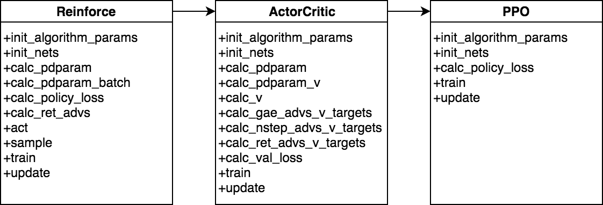

# Class Inheritance: A2C &gt; PPO

## 🌿 REINFORCE &gt; A2C \(Actor-Critic\) &gt; PPO

To showcase of the taxonomy-based/class inheritance implementation in SLM Lab, Proximal Policy Optimization \(PPO\) [\(Schulman et al., 2017\)](https://arxiv.org/abs/1707.06347) is a good example. When considered as a stand alone algorithm, PPO has a number of different components. However, it differs from the Actor-Critic algorithm only in how it computes the policy loss, runs the training loop, and by needing to maintain an additional actor network during training. Figure below shows how this similarity is reflected in the SLM Lab implementation of PPO:

The result is that the PPO class in SLM Lab has five overridden methods and contains only about [140 lines of code \(excluding comments\)](https://github.com/kengz/SLM-Lab/blob/master/slm_lab/agent/algorithm/ppo.py). Implementing it was straightforward once the [ActorCritic class](https://github.com/kengz/SLM-Lab/blob/master/slm_lab/agent/algorithm/actor_critic.py) was already implemented and thoroughly tested. More importantly, we can be sure that the performance difference between Actor-Critic and PPO observed in experiments using SLM Lab are due to something in the 140 lines of code that differentiate ActorCritic and PPO, and not to other implementation differences.

