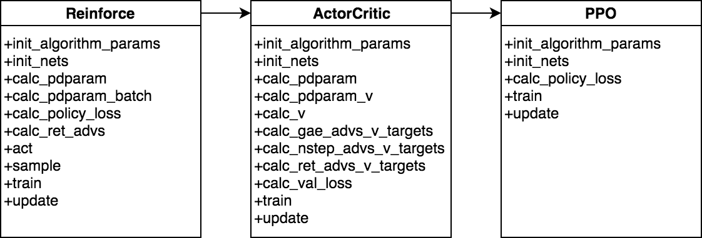

# Class Inheritance: A2C → PPO 🔗

## REINFORCE → ActorCritic → PPO

Proximal Policy Optimization (PPO) [(Schulman et al., 2017)](https://arxiv.org/abs/1707.06347) demonstrates SLM Lab's taxonomy-based inheritance. While PPO appears complex as a standalone algorithm, it differs from Actor-Critic in only a few key ways:

1. **Clipped surrogate objective** for policy updates
2. **Minibatch training** over multiple epochs
3. **Old network** for computing probability ratios



## Code Comparison

The PPO class inherits from ActorCritic and overrides only what's different:

```python
class PPO(ActorCritic):
    '''PPO is ActorCritic with a clipped surrogate objective'''

    def init_algorithm_params(self):
        # Calls parent, then adds PPO-specific params
        util.set_attr(self, dict(
            minibatch_size=4,
            clip_eps_spec=None,
            normalize_v_targets=False,
            clip_vloss=False,
        ))
        # ... set from spec ...
        self.clip_eps_scheduler = policy_util.VarScheduler(self.clip_eps_spec)

    def init_nets(self, global_nets=None):
        super().init_nets(global_nets)
        # PPO needs old_net for ratio computation
        self.old_net = deepcopy(self.net)

    def calc_policy_loss(self, batch, pdparams, advs):
        # The PPO clipped surrogate objective
        ratios = exp(log_probs - old_log_probs)
        sur_1 = ratios * advs
        sur_2 = clamp(ratios, 1-eps, 1+eps) * advs
        clip_loss = -min(sur_1, sur_2).mean()
        return clip_loss + entropy_penalty

    def train(self):
        # Minibatch training over multiple epochs
        self.old_net = copy(self.net)
        for epoch in range(training_epoch):
            for minibatch in split(batch, minibatch_size):
                # ... training step ...
```

## Inheritance Benefits

| Benefit | How PPO Demonstrates It |
|---------|-------------------------|
| **Code reuse** | `calc_v()`, `calc_advs_v_targets()`, network initialization all inherited |
| **Fewer bugs** | Only ~280 lines to review vs thousands for a standalone implementation |
| **Fair comparison** | Differences between A2C and PPO are exactly the overridden methods |
| **Easy extension** | Adding PPO variants (e.g., with different clipping) requires minimal code |

## Method Override Summary

| Method | ActorCritic | PPO Override |
|--------|-------------|--------------|
| `init_algorithm_params` | Sets gamma, lam, entropy_coef | Adds clip_eps, minibatch_size, time_horizon |
| `init_nets` | Creates actor/critic networks | Adds old_net copy |
| `calc_policy_loss` | Policy gradient with entropy | Clipped surrogate objective |
| `calc_val_loss` | MSE loss | Optional CleanRL-style clipping |
| `train` | Single gradient step | Multi-epoch minibatch training |

## Full Class Hierarchy

```
Algorithm (base class)
 ├── SARSA
 │    └── VanillaDQN → DQNBase → DQN → DoubleDQN
 └── Reinforce
      └── ActorCritic (A2C with GAE/n-step)
           ├── PPO (adds clipped objective)
           └── SoftActorCritic (adds entropy regularization)
```

Each level adds only its distinguishing features, making the codebase:

- **Readable**: Understanding PPO requires reading ~280 lines, not thousands
- **Testable**: Test ActorCritic once, trust it works for PPO
- **Comparable**: Performance differences between algorithms are attributable to their actual differences

## Running the Comparison

```bash
# Train ActorCritic
slm-lab run slm_lab/spec/benchmark/a2c/a2c_gae_cartpole.json a2c_gae_cartpole train

# Train PPO
slm-lab run slm_lab/spec/benchmark/ppo/ppo_cartpole.json ppo_cartpole train
```

Both use the same network architecture, memory, and environment setup—only the algorithm differs.
