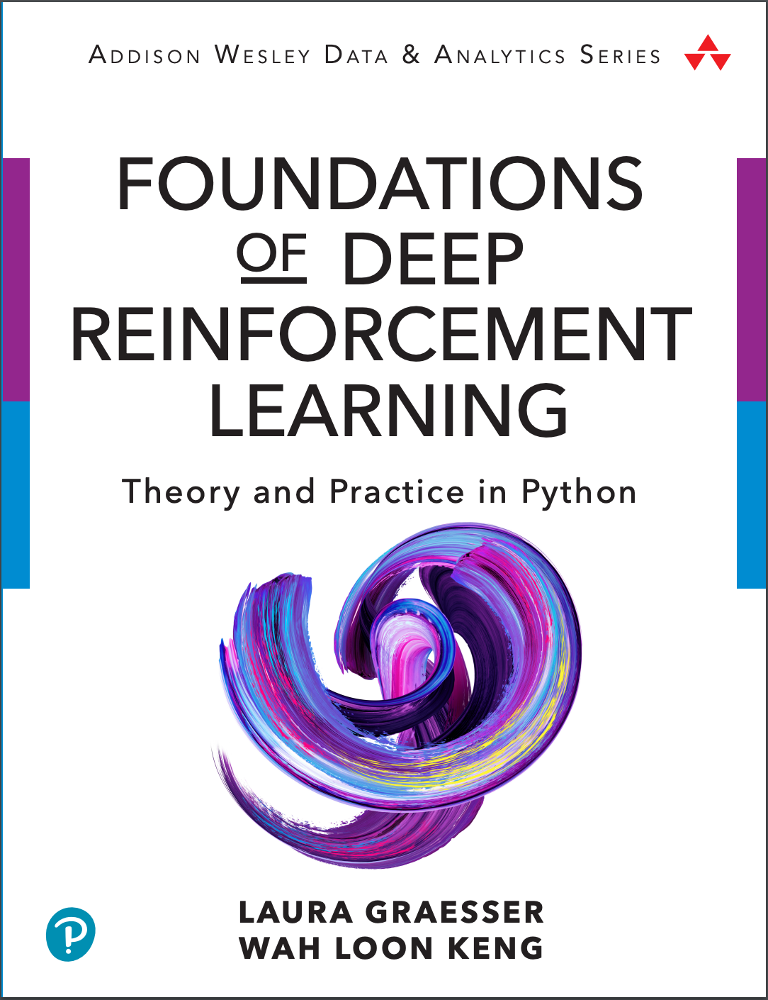

# Book: Foundations of Deep Reinforcement Learning

## 📖 Book

SLM Lab is the companion software library of the book [Foundations of Deep Reinforcement Learning](https://www.amazon.com/dp/0135172381) by the same authors Laura Graesser and Wah Loon Keng.



If you are a reader using SLM Lab as the companion library, check out to the dedicated git branch **"book"** that is compatible with the code examples in the book. Use the following complete installation instruction:

```bash
# clone the repository
git clone https://github.com/kengz/SLM-Lab.git
cd SLM-Lab/

# checkout the dedicated branch for this book
git checkout book

# install dependencies
./bin/setup
```


**Disclaimer:** the book is _not required_ for using SLM Lab. It is a separate effort aimed at providing approachable access to deep RL theories with practical implementations.


A summary of the book is provided below:

> **The Contemporary Introduction to Deep Reinforcement Learning that Combines Theory and Practice**  
>   
> Deep reinforcement learning \(deep RL\) combines deep learning and reinforcement learning, in which artificial agents learn to solve sequential decision-making problems. In the past decade deep RL has achieved remarkable results on a range of problems, from single and multiplayer games–such as Go, Atari games, and DotA 2–to robotics.  
>   
> **Foundations of Deep Reinforcement Learning** is an introduction to deep RL that uniquely combines both theory and implementation. It starts with intuition, then carefully explains the theory of deep RL algorithms, discusses implementations in its companion software library SLM Lab, and finishes with the practical details of getting deep RL to work.  
> This guide is ideal for both computer science students and software engineers who are familiar with basic machine learning concepts and have a working understanding of Python.
>
> * Understand each key aspect of a deep RL problem
> * Explore policy- and value-based algorithms, including REINFORCE, SARSA, DQN, Double DQN, and Prioritized Experience Replay \(PER\)
> * Delve into combined algorithms, including Actor-Critic and Proximal Policy Optimization \(PPO\)
> * Understand how algorithms can be parallelized synchronously and asynchronously
> * Run algorithms in SLM Lab and learn the practical implementation details for getting deep RL to work
> * Explore algorithm benchmark results with tuned hyperparameters
> * Understand how deep RL environments are designed

### Editorial Reviews

> _“This book provides an accessible introduction to deep reinforcement learning covering the mathematical concepts behind popular algorithms as well as their practical implementation. I think the book will be a valuable resource for anyone looking to apply deep reinforcement learning in practice.”_        –**Volodymyr Mnih, lead developer of DQN**
>
> _“An excellent book to quickly develop expertise in the theory, language, and practical implementation of deep reinforcement learning algorithms. A limpid exposition which uses familiar notation; all the most recent techniques explained with concise, readable code, and not a page wasted in irrelevant detours: it is the perfect way to develop a solid foundation on the topic.”_        –**Vincent Vanhoucke, principal scientist, Google**
>
> _“As someone who spends their days trying to make deep reinforcement learning methods more useful for the general public, I can say that Laura and Keng’s book is a welcome addition to the literature. It provides both a readable introduction to the fundamental concepts in reinforcement learning as well as intuitive explanations and code for many of the major algorithms in the field. I imagine this will become an invaluable resource for individuals interested in learning about deep reinforcement learning for years to come.”_        –**Arthur Juliani, senior machine learning engineer, Unity Technologies**
>
> _“Until now, the only way to get to grips with deep reinforcement learning was to slowly accumulate knowledge from dozens of different sources. Finally, we have a book bringing everything together in one place.”_        –**Matthew Rahtz, ML researcher, ETH Zürich**

