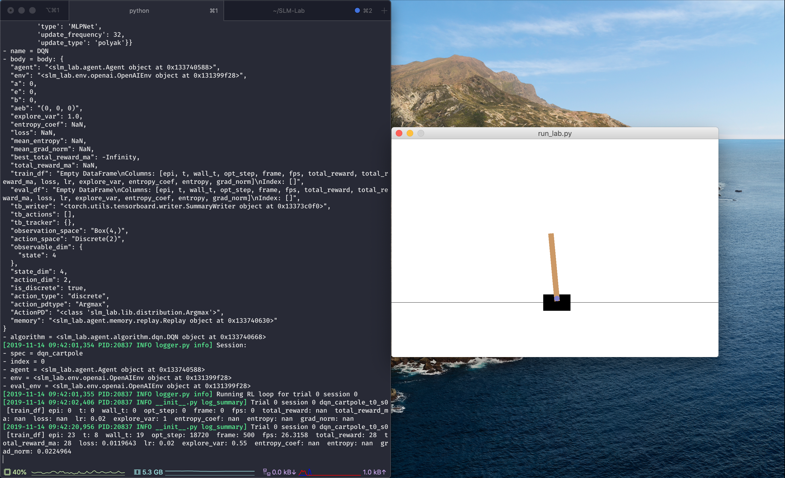

# Quick Start

## 🚀 DQN On CartPole

This quick demo will test that the installation works. We will run DQN on the CartPole environment. For now, don't worry about the details of the Python command, as we will walk through them in a [later section](../using-slm-lab/slm-lab-command.md).

```
conda activate lab
python run_lab.py slm_lab/spec/demo.json dqn_cartpole dev
```

This will run a session that trains a DQN agent on the CartPole-v0 environment. Since the command above specifies **dev** mode, it enables verbose logging and environment rendering, which should be similar to the following screenshot:



If you let the training session run for a few minutes, you should see the CartPole getting balanced for a longer period of time. Correspondingly, the `total_reward_ma` should increase.


If this quick start works, then SLM Lab is ready for use.



If you encounter an issue, consult the [**Help**](../resources/help.md) page.


