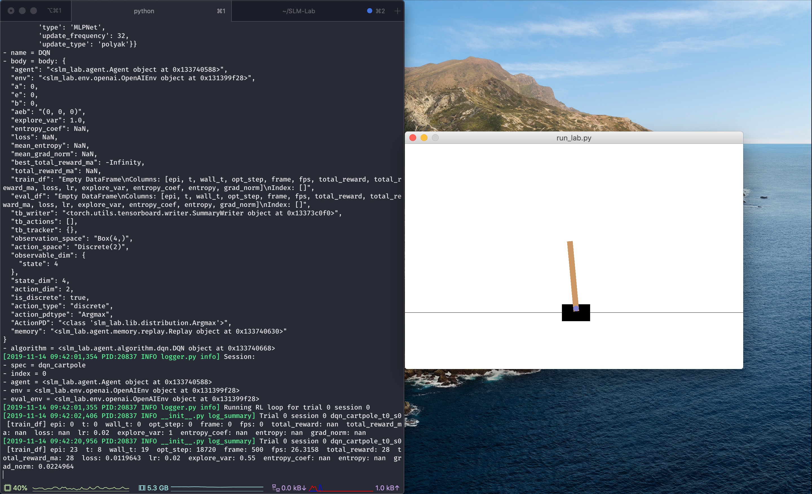

# Quick Start

## PPO on CartPole

This quick demo verifies your installation works and introduces SLM Lab's core workflow.

**What you'll see:**
- A CartPole environment being solved in real-time
- Training metrics updating in the terminal
- An agent learning from ~0 reward to 400+ reward

### The Task

**CartPole** is a classic RL benchmark: balance a pole on a cart by moving left or right. The agent receives +1 reward for each timestep the pole stays upright, with a maximum of 500 per episode.

**PPO** (Proximal Policy Optimization) is a widely-used RL algorithm that learns by:
1. Collecting experience by interacting with the environment
2. Computing how much better/worse each action was than expected (advantage)
3. Updating the policy to make good actions more likely

### Run the Demo

```bash
slm-lab run --render
```

This runs the default experiment: PPO on CartPole in dev mode.

### What to Expect

**Terminal output:**
```
[2024-01-15 12:00:00] INFO: Starting ppo_cartpole trial t0
[2024-01-15 12:00:05] INFO: frame: 1000 | total_reward: 23.5 | total_reward_ma: 23.5 | loss: 0.012
[2024-01-15 12:00:10] INFO: frame: 2000 | total_reward: 45.2 | total_reward_ma: 34.3 | loss: 0.008
...
[2024-01-15 12:02:30] INFO: frame: 50000 | total_reward: 500.0 | total_reward_ma: 487.2 | loss: 0.002
```

Key metrics:
- **frame**: Total environment steps processed
- **total_reward**: Episode reward at this checkpoint
- **total_reward_ma**: Moving average over 100 checkpoints (the primary success metric)
- **loss**: Training loss (should decrease over time)

**Rendering window:**



Early in training, the pole falls quickly. As `total_reward_ma` climbs toward 400-500, you'll see the agent balance for longer periods.

### Success Criteria

| Metric | Starting | Solved |
|--------|----------|--------|
| `total_reward_ma` | ~20-30 | 450+ |
| Episode length | ~20 steps | 500 steps (max) |

PPO typically solves CartPole within 50,000-100,000 frames (1-3 minutes).

### Stopping the Demo

Press `Ctrl+C` to stop. In dev mode, partial results are not saved.


If you see rewards climbing, SLM Lab is working correctly. Continue to [Lab Command](../using-slm-lab/slm-lab-command.md) to learn the CLI.



**Troubleshooting:** If you encounter errors, see [Help](../resources/help.md) for common issues and solutions.


## Next Steps

Now that you've verified the installation:

1. **[Lab Command](../using-slm-lab/slm-lab-command.md)** - Learn CLI options and modes
2. **[Lab Organization](../using-slm-lab/lab-organization.md)** - Understand Sessions, Trials, Experiments
3. **[Train: PPO CartPole](../using-slm-lab/train-and-enjoy-dqn-cartpole.md)** - Run a full training with saved results

## Understanding the Output

When you run `slm-lab run --render`, SLM Lab:

1. **Loads the default spec** (`slm_lab/spec/benchmark/ppo/ppo_cartpole.json`)
2. **Creates the environment** (CartPole-v1 with 4 parallel instances)
3. **Initializes the agent** (PPO with MLPNet)
4. **Runs the training loop**:
   - Agent selects actions based on current policy
   - Environment returns rewards and next states
   - Memory stores the experience
   - Every 256 steps, PPO trains on the collected data
5. **Logs metrics** every 500 frames

The `--render` flag enables visualization, which slows training but lets you watch the agent learn.
