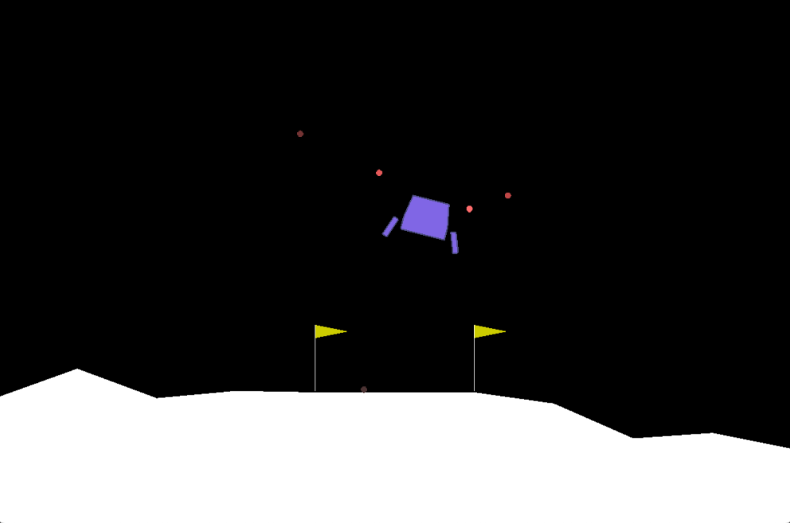
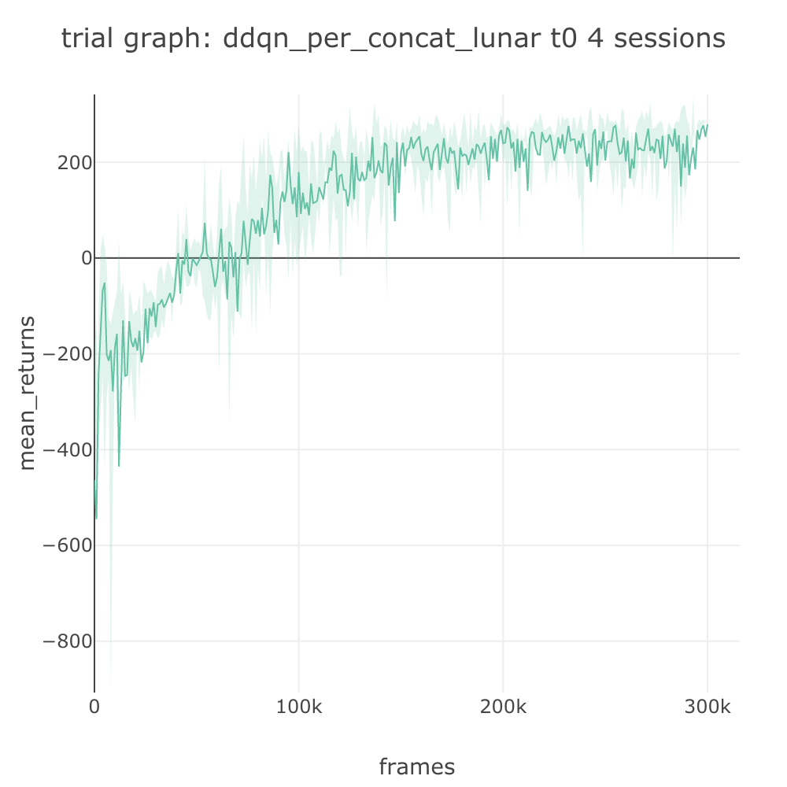
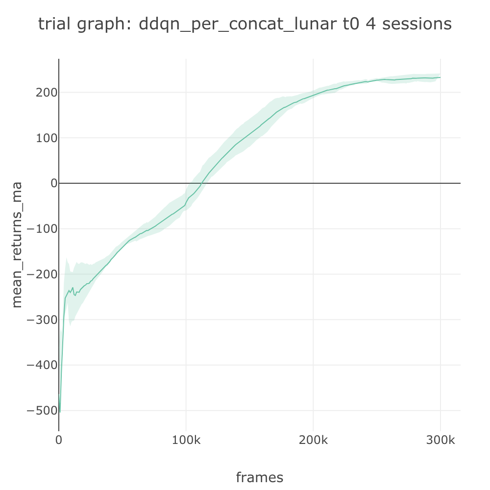

# Agent Spec: DDQN+PER on LunarLander

## 📂The Agent Spec

In this tutorial we look at how to use an **agent spec** to specify an agent, which comprises of its algorithm, memory, and neural network. We will train a DDQN+PER agent on the LunarLander environment.

The agent is specified using the **agent** key in a spec file with the following format. It comprises of **algorithm spec**, **memory spec**, and **net spec**, which allows us to specify and compose modular components together in SLM Lab.

```javascript
{
  "{spec_name}": {
    "agent": [{
      "name": str,
      "algorithm": {
        // Name of an algorithm class in slm_lab/agent/algorithm/
        "name": str,
        
        // The probability distribution class used for sampling actions, declared in slm_lab/agent/algorithm/policy_util.py
        // - "default": use the default distribution based on the action type (discrete/continuous) of the environment
        // - {str}: use a custom distribution
        "action_pdtype": str,
        
        // The action policy used, defined in slm_lab/agent/algorithm/policy_util.py
        // - "default": directly sample action from the action distribution
        // - "random": sample action randomly from the environment's action space
        // - "epsilon_greedy": use epsilon-greedy policy (e.g. for DQN family)
        // - "boltzmann": use Boltzmann policy (e.g. for DQN family)
        "action_policy": str,
        
        // Algorithm-specific options
        ...
      },
      "memory": {
        // Name of a memory class in slm_lab/agent/memory/
        "name": str,
        
        // Memory-specific options
        ...
      },
      "net": {
        // Name of a network class in slm_lab/agent/net/
        "type": str,
        
        // Network-specific options
        ...
      }
    }],
    "env": [{...}],
    ...
  }
}
```


The agent spec is a list to accommodate for multi-agent setting in the future version of SLM Lab. For full detail on agent spec, refer to [Algorithm](../development/algorithms/#algorithm-spec).


## ✍ Agent Spec for DDQN+PER

As an example, let's look at the agent spec for DDQN+PER \(Double DQN + Prioritized Experience Replay\) on LunarLander from [slm\_lab/spec/benchmark/dqn/ddqn\_per\_lunar.json](https://github.com/kengz/SLM-Lab/blob/master/slm_lab/spec/benchmark/dqn/ddqn_per_lunar.json).


```javascript
{
  "ddqn_per_concat_lunar": {
    "agent": [{
      "name": "DoubleDQN",
      "algorithm": {
        "name": "DoubleDQN",
        "action_pdtype": "Argmax",
        "action_policy": "epsilon_greedy",
        "explore_var_spec": {
          "name": "linear_decay",
          "start_val": 1.0,
          "end_val": 0.01,
          "start_step": 0,
          "end_step": 50000
        },
        "gamma": 0.99,
        "training_batch_iter": 1,
        "training_iter": 1,
        "training_frequency": 1,
        "training_start_step": 32
      },
      "memory": {
        "name": "PrioritizedReplay",
        "alpha": 0.6,
        "epsilon": 0.0001,
        "batch_size": 32,
        "max_size": 50000,
        "use_cer": false,
      },
      "net": {
        "type": "MLPNet",
        "hid_layers": [256, 128],
        "hid_layers_activation": "relu",
        "clip_grad_val": 10.0,
        "loss_spec": {
          "name": "SmoothL1Loss"
        },
        "optim_spec": {
          "name": "Adam",
          "lr": 2.5e-4
        },
        "lr_scheduler_spec": null,
        "update_type": "replace",
        "update_frequency": 100,
        "gpu": false
      }
    }],
    "env": [{
      "name": "LunarLander-v2",
      ...
    }],
    ...
  }
}
```


Here, we specify **algorithm spec** as "DoubleDQN", which is an algorithm class implemented in `slm_lab/agent/algorithm/dqn.py`. In particular, we are using the epsilon-greedy policy with the epsilon decay further specified in the **"explore\_var\_spec"**.

Thanks to the modular design of SLM Lab, we can compose DDQN with PER by simply specifying the **memory spec** to use "PrioritizedReplay". The total capacity of the memory and the batch size used for sampling elements from it is also given here.

Likewise, we are using a multi-layer perceptron \(feedforward\) network as the function approximator for DDQN, as given by the **net spec**. Notice how we fully expose the network architecture configuration in the spec, including the hidden layers and activation function. The input and output layers of the network is automatically inferred from the algorithm and environment's state space and action space. The loss function, network optimizer, learning rate scheduler, and training device are also specified here. No GPU is required for this training since LunarLander is not image-based.


A full rundown of the spec requires a complete understanding of the algorithm at hand and the source code of SLM Lab. See [Learning Deep RL](../resources/untitled.md) for a list of recommended resources.


## 🚀 Running DDQN+PER on LunarLander

Let's run a Trial using the spec file above. First, run it in **dev** mode to see the rendering the LunarLander environment.

```bash
python run_lab.py slm_lab/spec/benchmark/dqn/ddqn_per_lunar.json ddqn_per_concat_lunar dev
```



This is a harder environment with a vector state \(8 dimensions\) and a discrete action \(4 values\). A rendering of the environment is shown below. The goal of the task is to steer and land a spacecraft at the landing pad at the center between the two flags. The solution reward is above 200.

Now, let's terminate \(`Ctrl+C`\) and rerun it in **train** mode for the full duration.

```bash
python run_lab.py slm_lab/spec/benchmark/dqn/ddqn_per_lunar.json ddqn_per_concat_lunar train
```

This trial will take only a few hours to complete, and we will see the graphs similar to the ones below generated and saved to the `data/ddqn_per_concat_lunar_{ts}` folder.

The trial graph is an average of the 4 session graphs, each of which plots the episodic rewards once every 1,000 steps averaged over all the vector environments.



We can also smoothen the trial graph by plotting its moving average over a window of 100 to obtain the graph below.



This tutorial shows us how to configure an agent using the spec file. Next, we will look at the how to configure an environment.

