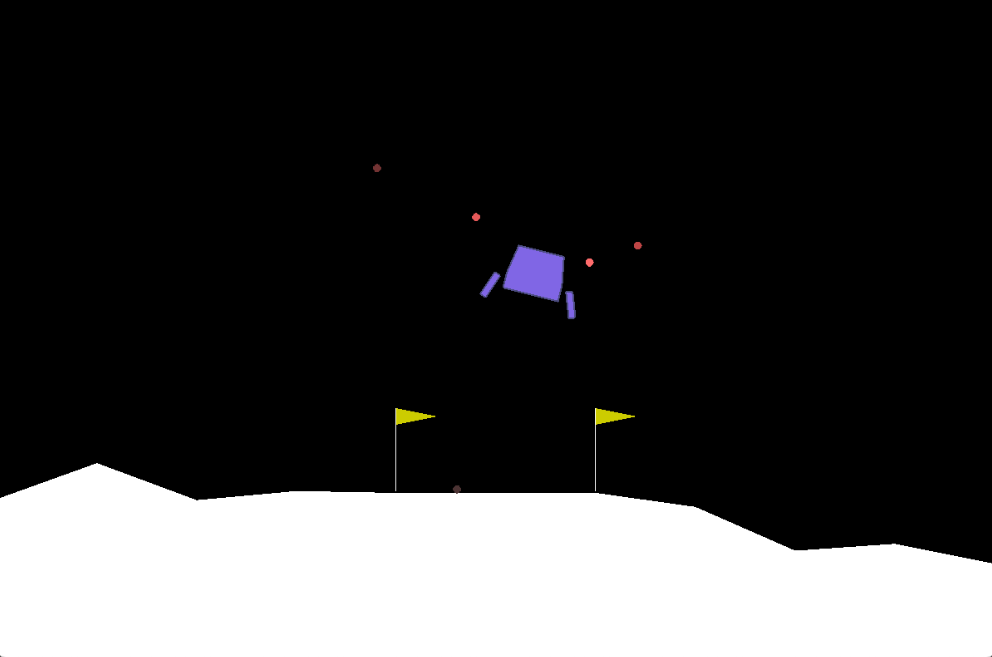

# Agent Spec 🤖

This tutorial shows how to configure an agent's algorithm, memory, and neural network. We'll train a **DDQN+PER** agent on LunarLander—a spacecraft landing task.

## What is DDQN+PER?

| Component | What It Does |
|-----------|--------------|
| **DDQN** (Double DQN) | Reduces overestimation of Q-values by using separate networks for action selection and evaluation |
| **PER** (Prioritized Experience Replay) | Learns faster by prioritizing surprising transitions (high TD error) |

Together, they create a more stable, sample-efficient agent than vanilla DQN.


You don't need to understand these algorithms in detail to follow this tutorial. The goal is to show how SLM Lab's spec system works.


## The Agent Spec Structure

Every agent in SLM Lab is configured with three components:

```javascript
{
  "spec_name": {
    "agent": {
      "name": "AgentName",       // For logging
      "algorithm": {...},        // Algorithm configuration
      "memory": {...},           // Experience storage
      "net": {...}               // Neural network
    },
    "env": {...},
    "meta": {...}
  }
}
```

## Available Algorithms

SLM Lab implements these RL algorithm families:

### Policy Gradient

| Algorithm | Variant | Action Space | Description |
|-----------|---------|--------------|-------------|
| **REINFORCE** | — | Discrete/Continuous | Monte Carlo policy gradient baseline |
| **A2C** | GAE | Discrete/Continuous | Actor-Critic with Generalized Advantage Estimation |
| **A2C** | n-step | Discrete/Continuous | Actor-Critic with n-step returns |
| **A3C** | GAE | Discrete/Continuous | Async A2C with Hogwild! (multi-process) |
| **A3C** | n-step | Discrete/Continuous | Async n-step A2C |
| **PPO** | — | Discrete/Continuous | Proximal Policy Optimization (recommended) |

### Value-Based

| Algorithm | Variant | Action Space | Description |
|-----------|---------|--------------|-------------|
| **SARSA** | — | Discrete | On-policy TD learning baseline |
| **DQN** | vanilla | Discrete | Deep Q-Network with experience replay |
| **DQN** | Double (DDQN) | Discrete | Reduced overestimation bias |
| **DQN** | PER | Discrete | Prioritized Experience Replay |
| **DQN** | DDQN+PER | Discrete | Combined Double DQN + PER |
| **DQN** | Dueling | Discrete | Separate value/advantage streams |

### Actor-Critic (Off-Policy)

| Algorithm | Variant | Action Space | Description |
|-----------|---------|--------------|-------------|
| **SAC** | — | Discrete/Continuous | Soft Actor-Critic with entropy regularization |
| **Async SAC** | — | Continuous | SAC with Hogwild! (multi-process) |

**Quick guide:**
- **New to RL?** Start with PPO—it's robust and works well across most environments
- **Discrete actions (Atari, CartPole)?** Try DQN/DDQN for sample efficiency or PPO for stability
- **Continuous actions (MuJoCo, robotics)?** Use PPO or SAC
- **Need sample efficiency?** SAC with high replay ratio or DDQN+PER
- **Multi-process training?** A3C or Async SAC

See [Benchmark Specs](benchmark-specs.md) for complete spec files for each algorithm.

## Example: DDQN+PER Spec

Here's the full spec from [slm\_lab/spec/benchmark/dqn/ddqn\_per\_lunar.json](https://github.com/kengz/SLM-Lab/blob/master/slm_lab/spec/benchmark/dqn/ddqn_per_lunar.json):

```javascript
{
  "ddqn_per_concat_lunar": {
    "agent": {
      "name": "DoubleDQN",
      "algorithm": {
        "name": "DoubleDQN",
        "action_pdtype": "Argmax",
        "action_policy": "epsilon_greedy",
        "explore_var_spec": {
          "name": "linear_decay",
          "start_val": 1.0,
          "end_val": 0.01,
          "start_step": 0,
          "end_step": 50000
        },
        "gamma": 0.99,
        "training_batch_iter": 1,
        "training_iter": 4,
        "training_frequency": 1,
        "training_start_step": 32
      },
      "memory": {
        "name": "PrioritizedReplay",
        "alpha": 0.6,
        "epsilon": 0.0001,
        "batch_size": 32,
        "max_size": 50000,
        "use_cer": false
      },
      "net": {
        "type": "MLPNet",
        "hid_layers": [256, 128],
        "hid_layers_activation": "relu",
        "clip_grad_val": 10.0,
        "loss_spec": {
          "name": "SmoothL1Loss"
        },
        "optim_spec": {
          "name": "AdamW",
          "lr": 2.5e-4
        },
        "update_type": "replace",
        "update_frequency": 100,
        "gpu": "auto"
      }
    },
    "env": {
      "name": "LunarLander-v3",
      "num_envs": 8,
      "max_t": null,
      "max_frame": 300000
    },
    "meta": {
      "distributed": false,
      "log_frequency": 1000,
      "eval_frequency": 1000,
      "max_session": 4,
      "max_trial": 1
    }
  }
}
```

## Algorithm Spec Breakdown

```javascript
"algorithm": {
  "name": "DoubleDQN",              // Algorithm class
  "action_pdtype": "Argmax",        // Take argmax of Q-values
  "action_policy": "epsilon_greedy", // Explore with probability epsilon

  "explore_var_spec": {             // Epsilon schedule
    "name": "linear_decay",         // Linear interpolation
    "start_val": 1.0,               // Start fully random
    "end_val": 0.01,                // End nearly greedy
    "start_step": 0,
    "end_step": 50000               // Decay over 50k steps
  },

  "gamma": 0.99,                    // Discount factor
  "training_batch_iter": 1,         // Gradient steps per batch
  "training_iter": 4,               // Batches per training call
  "training_frequency": 1,          // Train every step
  "training_start_step": 32         // Wait for 32 samples first
}
```

**Key concepts:**

| Parameter | Effect |
|-----------|--------|
| `action_policy: "epsilon_greedy"` | Random action with probability ε, greedy otherwise |
| `gamma: 0.99` | Value future rewards highly (long-horizon) |
| `training_frequency: 1` | Train on every environment step |
| `training_start_step: 32` | Collect initial batch before training |

## Memory Spec Breakdown

```javascript
"memory": {
  "name": "PrioritizedReplay",      // PER for better sample efficiency
  "alpha": 0.6,                     // How much to prioritize (0=uniform, 1=full priority)
  "epsilon": 0.0001,                // Small constant to avoid zero priority
  "batch_size": 32,                 // Samples per training batch
  "max_size": 50000,                // Buffer capacity
  "use_cer": false                  // Combined Experience Replay (include latest)
}
```

**Key concepts:**

| Parameter | Effect |
|-----------|--------|
| `alpha: 0.6` | Moderate prioritization (0=uniform sampling, 1=strict priority) |
| `batch_size: 32` | Each training step uses 32 transitions |
| `max_size: 50000` | Store up to 50k transitions (oldest deleted when full) |

## Net Spec Breakdown

```javascript
"net": {
  "type": "MLPNet",                 // Fully connected network
  "hid_layers": [256, 128],         // Two hidden layers
  "hid_layers_activation": "relu",  // ReLU activation
  "clip_grad_val": 10.0,            // Gradient clipping
  "loss_spec": {
    "name": "SmoothL1Loss"          // Huber loss (robust to outliers)
  },
  "optim_spec": {
    "name": "AdamW",
    "lr": 2.5e-4                    // Learning rate
  },
  "update_type": "replace",         // Hard target network update
  "update_frequency": 100,          // Update target every 100 steps
  "gpu": "auto"                     // Use GPU if available
}
```

**Key concepts:**

| Parameter | Effect |
|-----------|--------|
| `hid_layers: [256, 128]` | First layer has 256 units, second has 128 |
| `SmoothL1Loss` | Huber loss—less sensitive to outliers than MSE |
| `update_type: "replace"` | Periodically copy online network to target |
| `update_frequency: 100` | Copy weights every 100 training steps |

## Running the Experiment

### Dev Mode (Quick Test)

```bash
slm-lab run slm_lab/spec/benchmark/dqn/ddqn_per_lunar.json ddqn_per_concat_lunar dev
```

You'll see the LunarLander environment rendering:



**[LunarLander-v3](https://gymnasium.farama.org/environments/box2d/lunar_lander/)** is a classic control task: land a spacecraft safely between two flags using four discrete actions (left thruster, right thruster, main engine, or nothing). The agent receives reward for moving toward the landing pad and penalty for crashing or using fuel.


**Gymnasium Note:** LunarLander-v3 (Gymnasium) has stricter termination conditions than LunarLander-v2 (OpenAI Gym). Scores are typically lower than older benchmarks. See [Gymnasium docs](https://gymnasium.farama.org/environments/box2d/lunar_lander/) for details.


### Train Mode (Full Training)

```bash
slm-lab run slm_lab/spec/benchmark/dqn/ddqn_per_lunar.json ddqn_per_concat_lunar train
```

This runs 4 sessions with different random seeds. Expect ~1-2 hours for completion.

### Results

After training, graphs are saved to `data/ddqn_per_concat_lunar_{timestamp}/` (e.g., `ddqn_per_concat_lunar_2026_01_30_215532`):

**Trial graph (average of 4 sessions):**


**Moving average (100-checkpoint window):**


The target score for LunarLander-v3 is 200. DDQN+PER reaches **261.5** MA with this configuration. See [Discrete Benchmark](../benchmark-results/discrete-benchmark.md) for full results.

Trained models are available on [HuggingFace](https://huggingface.co/datasets/SLM-Lab/benchmark/tree/main/data/ddqn_per_concat_lunar_2026_01_30_215532).

## Modifying the Spec

### Change the Algorithm

Switch from DDQN to plain DQN:

```javascript
"algorithm": {
  "name": "DQN",  // Changed from DoubleDQN
  ...
}
```

### Change the Memory

Switch from PER to uniform replay:

```javascript
"memory": {
  "name": "Replay",  // Changed from PrioritizedReplay
  "batch_size": 32,
  "max_size": 50000,
  "use_cer": true    // Add CER for stability
}
```

### Change the Network

Use a larger network:

```javascript
"net": {
  "type": "MLPNet",
  "hid_layers": [512, 256, 128],  // Deeper network
  ...
}
```

## Using Other Algorithms

To use a different algorithm, find its spec file and change `algorithm.name`. All algorithm specs are in `slm_lab/spec/benchmark/`:

| Algorithm | Spec Directory | Example Spec |
|-----------|----------------|--------------|
| **REINFORCE** | `slm_lab/spec/benchmark/reinforce/` | `reinforce_cartpole.json` |
| **SARSA** | `slm_lab/spec/benchmark/sarsa/` | `sarsa_cartpole.json` |
| **DQN** | `slm_lab/spec/benchmark/dqn/` | `dqn_cartpole.json`, `dqn_lunar.json` |
| **DDQN+PER** | `slm_lab/spec/benchmark/dqn/` | `ddqn_per_lunar.json` |
| **A2C** | `slm_lab/spec/benchmark/a2c/` | `a2c_cartpole.json`, `a2c_gae_lunar.json` |
| **PPO** | `slm_lab/spec/benchmark/ppo/` | `ppo_cartpole.json`, `ppo_lunar.json`, `ppo_atari.json` |
| **SAC** | `slm_lab/spec/benchmark/sac/` | `sac_lunar.json`, `sac_pendulum.json` |

### Switching Algorithms

1. **Find a spec** for your target algorithm in the directories above
2. **Copy and modify** the agent section, or use the spec directly
3. **Run** with `slm-lab run <spec_file> <spec_name> train`

Example—switch from DDQN to PPO on the same environment:

```bash
# DDQN
slm-lab run slm_lab/spec/benchmark/dqn/ddqn_per_lunar.json ddqn_per_concat_lunar train

# PPO (same environment, different algorithm)
slm-lab run slm_lab/spec/benchmark/ppo/ppo_lunar.json ppo_lunar train
```

### Algorithm-Specific Notes

| Algorithm | Memory Type | Action Space | Key Parameters |
|-----------|-------------|--------------|----------------|
| **REINFORCE** | `OnPolicyReplay` | Discrete/Continuous | `gamma` |
| **SARSA** | `OnPolicyReplay` | Discrete | `gamma`, `lam` |
| **DQN/DDQN** | `Replay`, `PrioritizedReplay` | Discrete | `gamma`, `explore_var_spec`, `training_frequency` |
| **A2C** | `OnPolicyBatchReplay` | Discrete/Continuous | `gamma`, `lam`, `entropy_coef` |
| **PPO** | `OnPolicyBatchReplay` | Discrete/Continuous | `gamma`, `lam`, `clip_eps`, `time_horizon` |
| **SAC** | `Replay` | Continuous | `gamma`, `alpha` (entropy), `training_iter` |


**Finding more specs:** Run `ls slm_lab/spec/benchmark/` to see all algorithm directories. Each contains spec files for various environments.


## What's Next

- [Env Spec](environment-spec-a2c-on-bipedalwalker.md) - Configure environments
- [Meta Spec](meta-spec-high-level-specifications.md) - Control training sessions
- [Search Spec](search-spec-ppo-on-breakout.md) - Find optimal hyperparameters
