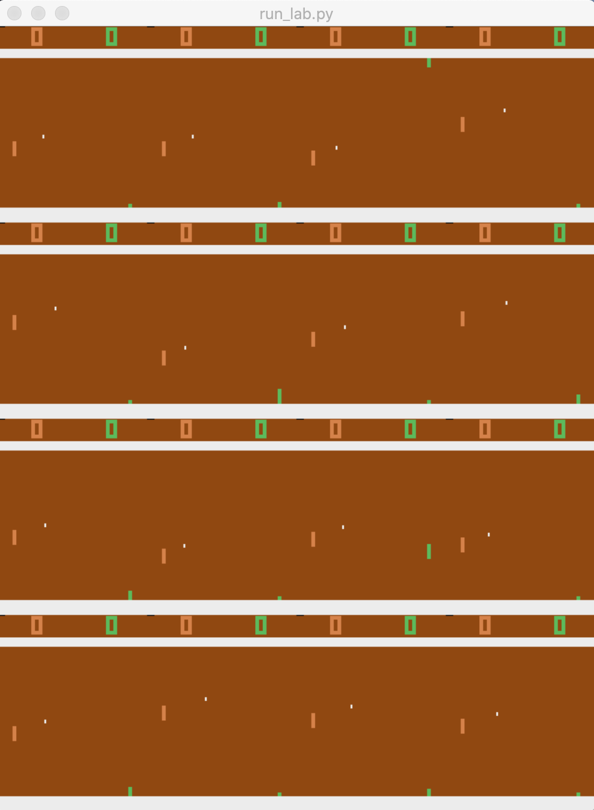
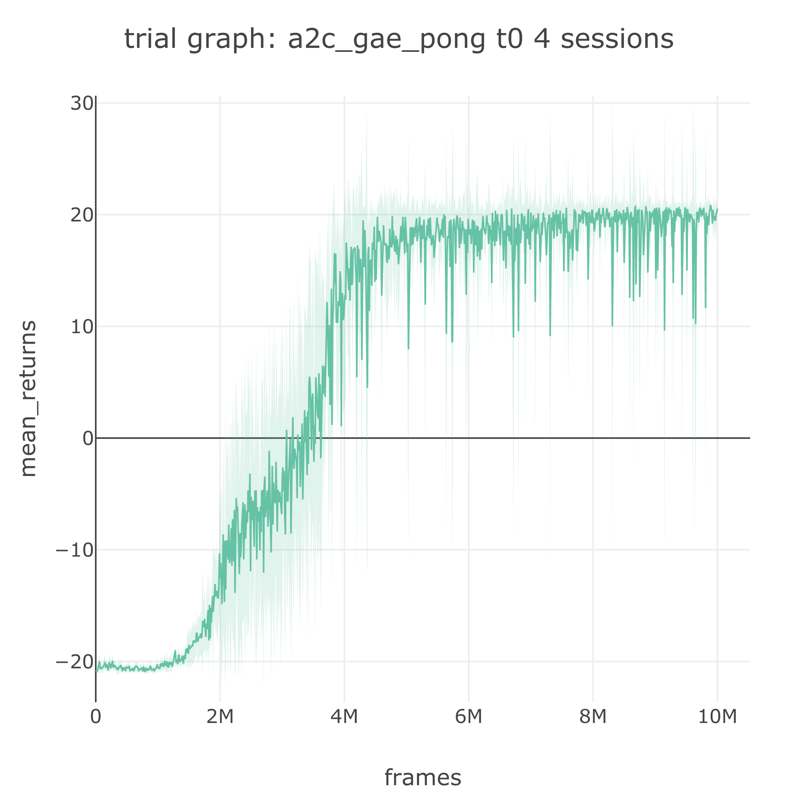
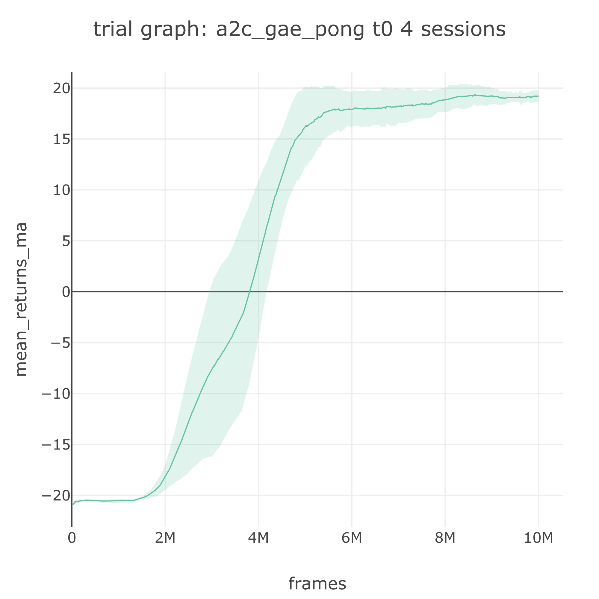

# Env Spec: A2C on Pong

## 📂The Env Spec

In this tutorial we look at how to use an **env spec** to specify an environment used to train an agent. We will train an A2C agent on the Atari Pong environment.

The environment is specified using the **env** key in a spec file with the following format:

```javascript
{
  "{spec_name}": {
    "agent": [{...}],
    "env": [{
        // Parameter for gym.make()
        // the name must be found in the gym registry
        "name": str,
        
        // Parameter for <env.wrapper.FrameStack>:
        // - "concat": apply np.concatenate to frames, e.g. concatenate 4 images with shape (1, 84, 84)
        // - "stack": apply np.stack to frames (a new stacking dimension will be created)
        // - null: no frame preprocessing will be applied
        "frame_op": str|null,
        
        // Parameter for <env.wrapper.FrameStack>:
        // - {int}: the number of successive frames used for frame_op; 4 is common.
        // - null: when frame_op is null
        "frame_op_len": int|null,
        
        // Parameter for <env.wrapper.NormalizeStateEnv>
        // apply on-line normalization to state
        "normalize_state": bool,

        // Parameter for <env.wrapper.ScaleRewardEnv>
        // - "sign": transform reward wiht np.sign to yield -1, 0, or +1
        // - {int|float}: scale reward by the given number
        // - null, no reward scaling is applied
        "reward_scale": null|str|int|float,
        
        // Parameter for <env.vec_env.ShmemVecEnv>
        // If > 1, this will apply asynchronous parallelization to spawn vector environments
        "num_envs": int,

        // The maximum time steps per episode
        // - {int|float}: use the given number as the maximum time steps
        // - null: default to the maximum time steps defined in the environment
        "max_t": int|null,

        // The maximum frames (total time steps) to run a sess
        "max_frame": int,
    }],
    ...
  }
}
```


The env spec is a list to accommodate for multi-environment setting in the future version of SLM Lab.


## ✍ Env Spec for Atari Pong

As an example, let's look at the env spec for A2C on Pong from [slm\_lab/spec/benchmark/a2c/a2c\_gae\_pong.json](https://github.com/kengz/SLM-Lab/blob/master/slm_lab/spec/benchmark/a2c/a2c_gae_pong.json).


```javascript
{
  "a2c_gae_pong": {
    "agent": [{
      "name": "A2C",
      ...
    }],
    "env": [{
      "name": "PongNoFrameskip-v4",
      "frame_op": "concat",
      "frame_op_len": 4,
      "reward_scale": "sign",
      "num_envs": 16,
      "max_t": null,
      "max_frame": 1e7
    }],
    ...
  }
}
```


Here, we are using the "PongNoFrameskip-v4" environment from gym. This allows us to specify our own state-preprocessing method. Each frame is an automatically-processed greyscale image of shape \(1, 84, 84\). To restore the temporal aspect of the frames, it is useful to concatenate 4 successive frames together as specified by **"frame\_op"** and **"frame\_op\_len"**, so the shape of the input state to A2C becomes \(4, 84, 84\).


For Atari environments, we also apply frame-skipping internally via before doing any state-processing. This is done using the `<env.wrapper.MaxAndSkipEnv>` wrapper. Effectively, we are concatenating 4 frames selected from the span of 16 raw frames.


To standardize the range of rewards in Atari environments, we also preprocess the rewards to -1, 0, or +1 by taking the sign of the raw reward, as specified in **"reward\_scale"**.

In order to speed up training, we asynchronously parallelize the stepping of environment by using a vector of 16 sub-environments, as specified in **"num\_envs"**. This means that at every environment step, A2C gets a batch of 16 states from 16 instances of the same environment with different random seeds.

Finally, we train A2C using a total of 10 million frames, specified in **"max\_frame"**. Note that when parallelizing using vector environment, the environment will actually step \(10 million / 16\) times. This is so that the total frame-count will sum up to **"max\_frame"** \(with some modular-remainder\) regardless of how many vector environments were used.

## 🚀 Running A2C on Pong

Let's run a Trial using the spec file above. First, run it in **dev** mode to see the rendering of 16 vector environments.

```bash
python run_lab.py slm_lab/spec/benchmark/a2c/a2c_gae_pong.json a2c_gae_pong dev
```



We can see these environments are in fact different in their progression, so our agent will obtain a diverse set of experience from them.

Next, terminate \(`Ctrl+C`\) and rerun it in **train** mode for the full 10 million frames:

```bash
python run_lab.py slm_lab/spec/benchmark/a2c/a2c_gae_pong.json a2c_gae_pong train
```

The maximum score for Pong is 21; our learning agent will converge to an average score close to that. When the trial completes, we will see the graphs similar to the ones below generated and saved to the `data/a2c_gae_pong_{ts}` folder.

The trial graph is an average of the 4 session graphs, each of which plots the episodic rewards once every 10,000 steps averaged over all the vector environments.



We can also smoothen the trial graph by plotting its moving average over a window of 100 to obtain the graph below.



This trial will complete within a day if no GPU is used, which is still fairly quick in RL terms. In the next section, we will see how SLM Lab can easily enable GPU usage to speed up training on image-based environments like the Atari games.

