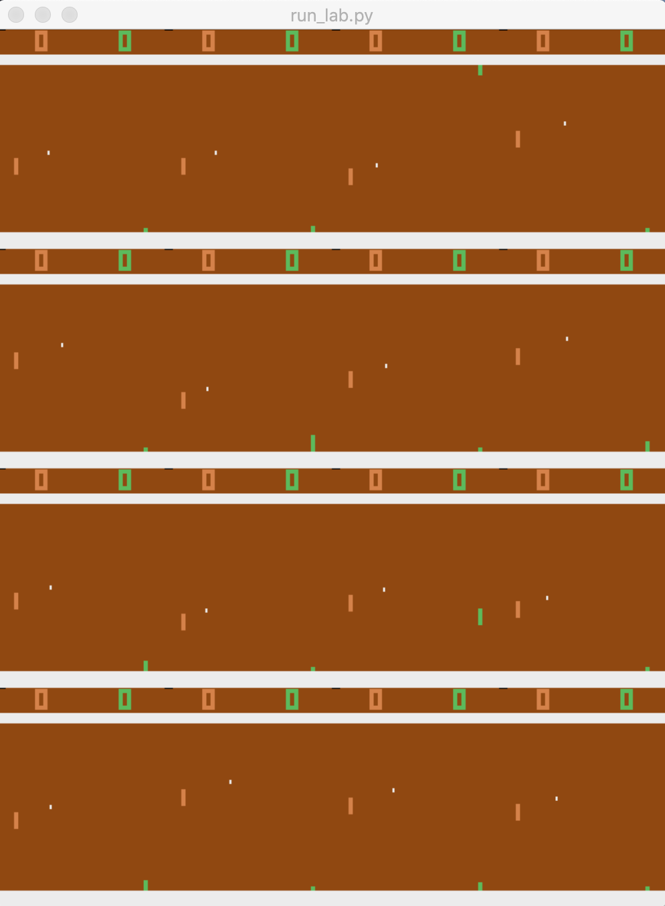
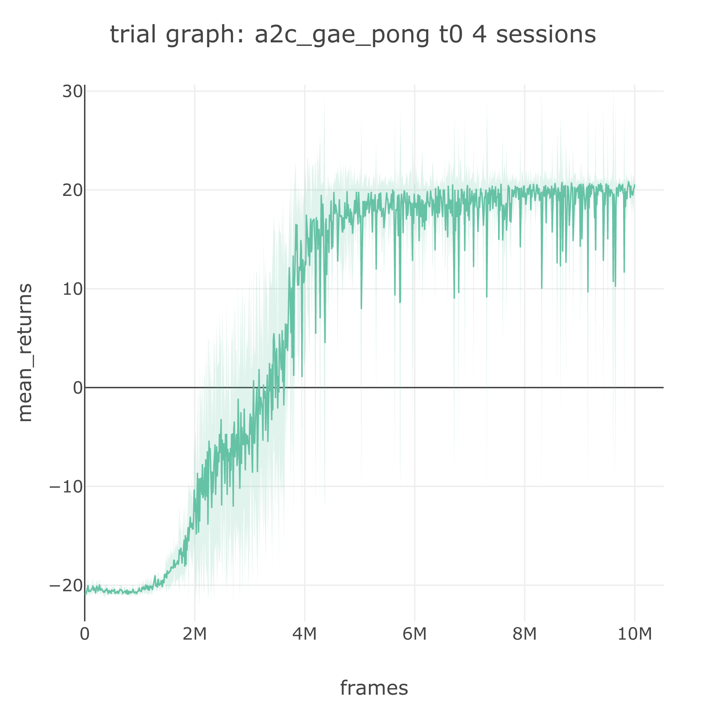
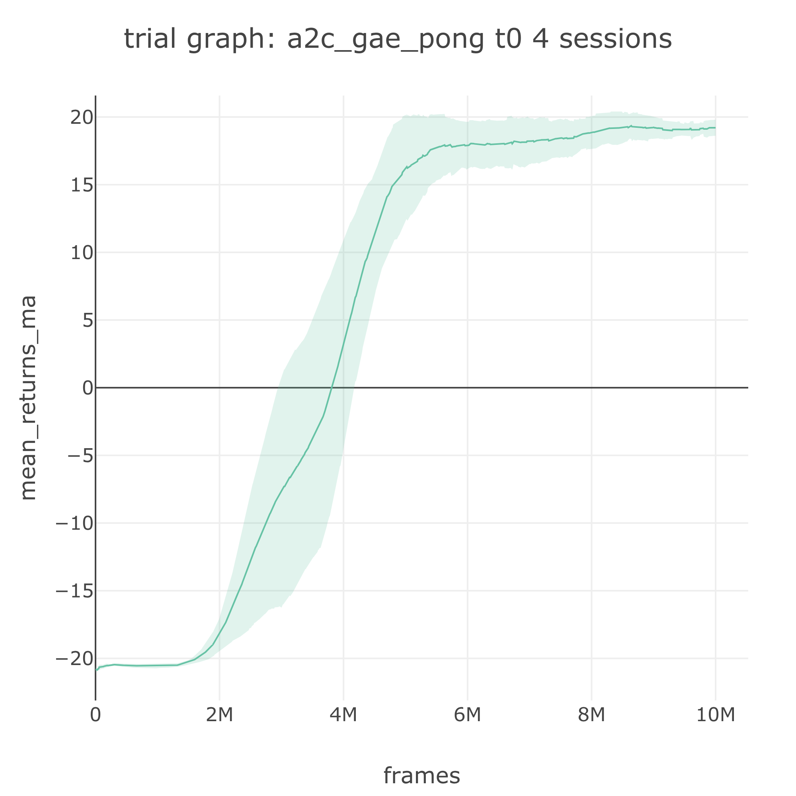

# Env Spec: A2C on Pong 🎮


**v5 Status**: A2C on Atari has not been re-validated in v5. For validated Atari training, use PPO—see [Run Benchmark: PPO on Atari](run-benchmark-a2c-on-atari-games.md). This tutorial focuses on the **env spec** configuration which applies to all algorithms.


## The Env Spec

In this tutorial we look at how to configure an **env spec** to specify an environment. We'll train an A2C agent on Atari Pong.

The environment is specified using the **env** key in a spec file:

```javascript
{
  "spec_name": {
    "agent": {...},
    "env": {
      // Environment name (must be in gymnasium registry)
      "name": str,

      // Number of parallel environment instances
      "num_envs": int,

      // Maximum timesteps per episode (null = use environment default)
      "max_t": int|null,

      // Total training frames
      "max_frame": int,

      // Optional: Frame stacking mode ("concat" or "stack")
      "frame_op": str|null,

      // Optional: Number of frames to stack (typically 4)
      "frame_op_len": int|null,

      // Optional: Reward scaling ("sign" for Atari, or a number)
      "reward_scale": str|int|float|null,

      // Optional: Online state normalization (MuJoCo)
      "normalize_obs": bool,

      // Optional: Online reward normalization (MuJoCo)
      "normalize_reward": bool,

      // Atari-specific: Continue after life loss (see Advanced Env Options)
      "life_loss_info": bool
    },
    ...
  }
}
```

## Env Spec for Atari Pong

Let's look at the A2C Pong spec from [slm\_lab/spec/benchmark/a2c/a2c\_gae\_pong.json](https://github.com/kengz/SLM-Lab/blob/master/slm_lab/spec/benchmark/a2c/a2c_gae_pong.json):


```javascript
{
  "a2c_gae_pong": {
    "agent": {
      "name": "A2C",
      "algorithm": {
        "name": "ActorCritic",
        "gamma": 0.99,
        "lam": 0.95,
        "training_frequency": 32
      },
      "memory": {
        "name": "OnPolicyBatchReplay"
      },
      "net": {
        "type": "ConvNet",
        "shared": true,
        "gpu": "auto"
      }
    },
    "env": {
      "name": "ALE/Pong-v5",
      "num_envs": 16,
      "max_t": null,
      "max_frame": 1e7
    },
    "meta": {
      "distributed": false,
      "log_frequency": 10000,
      "eval_frequency": 10000,
      "max_session": 4,
      "max_trial": 1
    }
  }
}
```


Key points:

* **"name": "ALE/Pong-v5"**: [Gymnasium's Arcade Learning Environment](https://gymnasium.farama.org/environments/atari/pong/). The ALE wrapper handles frame preprocessing (grayscale, 84x84 resize, frame stacking) automatically.
* **"num_envs": 16**: Run 16 parallel environment instances. Each step returns a batch of 16 states.
* **"max_frame": 1e7**: Train for 10 million total frames across all environments.

**Pong** is a classic Atari benchmark—first-to-21 points wins. The agent controls a paddle to return the ball. Optimal performance is +21 (never losing a point).


Gymnasium's ALE environments (v5) include standard Atari preprocessing. Frame stacking, grayscale conversion, and other preprocessing are handled by the environment wrapper.



**Gymnasium API:** SLM Lab v5 uses Gymnasium's new `(obs, reward, terminated, truncated, info)` return format. This correctly distinguishes between task completion (terminated) and time limits (truncated)—important for proper value estimation in MuJoCo environments.


## Running A2C on Pong

Run in **dev** mode to see the 16 parallel environments rendering:

```bash
slm-lab run slm_lab/spec/benchmark/a2c/a2c_gae_pong.json a2c_gae_pong dev
```



The environments run independently with different random seeds, providing diverse experience for training.

For full training, run in **train** mode:

```bash
slm-lab run slm_lab/spec/benchmark/a2c/a2c_gae_pong.json a2c_gae_pong train
```

Pong's maximum score is 21. With 16 parallel environments, the 10M frames complete in about a day on CPU.


**v5 Note:** Gymnasium ALE environments (v5) are more challenging than OpenAI Gym versions. The ALE wrapper uses deterministic frame skipping and stricter action handling. See [Gymnasium ALE docs](https://gymnasium.farama.org/environments/atari/) for details.


For validated Atari training curves, see [Atari Benchmark](../benchmark-results/atari-benchmark.md). The graphs below are from v4 A2C training:





Next, we'll see how to use GPU to speed up training on image-based environments.

## Advanced Env Options

### Atari: life_loss_info

For Atari games, `life_loss_info: true` enables proper game-over handling:

```javascript
"env": {
  "name": "ALE/Breakout-v5",
  "num_envs": 16,
  "max_frame": 1e7,
  "life_loss_info": true  // Continue game after life loss
}
```

With this option:
- The environment continues after losing a life (like CleanRL's EpisodicLifeEnv)
- Episode only ends when all lives are lost (true game over)
- This matches standard Atari benchmarking methodology


Without `life_loss_info: true`, Atari games terminate after each life loss, leading to artificially short episodes and incorrect scores.


### MuJoCo: Observation and Reward Normalization

For continuous control tasks, online normalization improves stability:

```javascript
"env": {
  "name": "Hopper-v5",
  "num_envs": 1,
  "max_frame": 1e6,
  "normalize_obs": true,    // Normalize observations with running stats
  "normalize_reward": true  // Normalize rewards with running stats
}
```

These options use gymnasium's `NormalizeObservation` and `NormalizeReward` wrappers, which maintain running statistics to standardize inputs. Recommended for MuJoCo environments.

### Environment Kwargs

Any additional keys in the env spec are passed directly to `gymnasium.make()`:

```javascript
"env": {
  "name": "ALE/Pong-v5",
  "num_envs": 16,
  "repeat_action_probability": 0.25  // Passed to ALE
}
```
