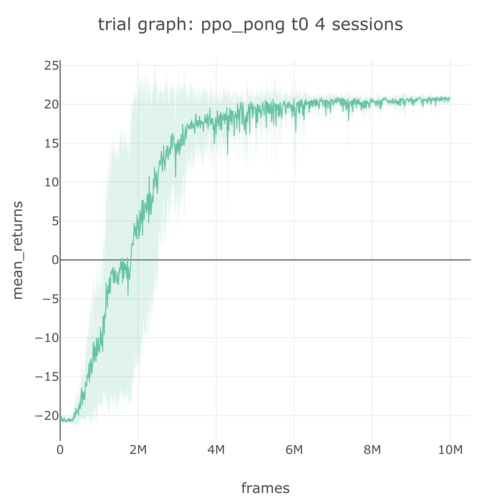
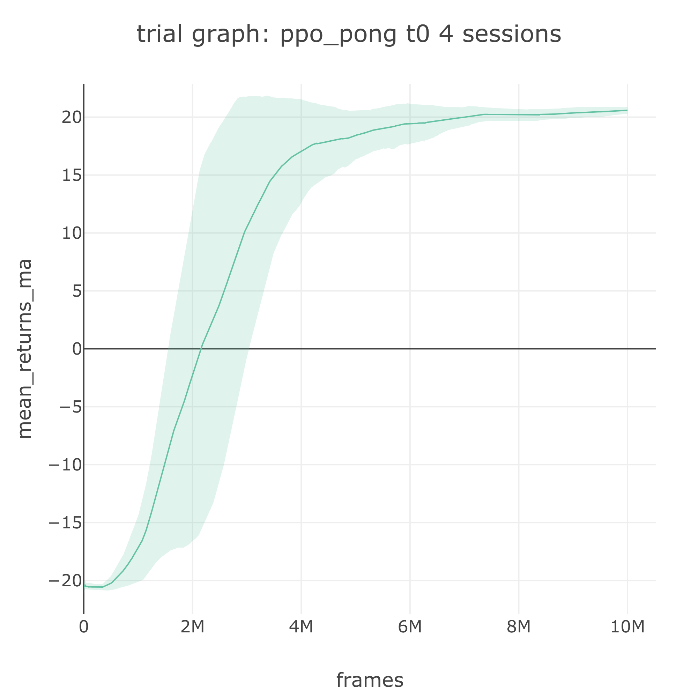

# GPU Usage: PPO on Pong

## GPU for Network Training

This tutorial requires a machine with a GPU with CUDA enabled. The default PyTorch installation supports GPU, so we don't need to do anything else.


If you are installing NVIDIA CUDA driver on your own hardware and encounter issues, consult [Help](../resources/help.md).


Training a convolutional network is slow on a CPU primarily due to the large network size. When training a large network, we can use a GPU to speed up the process. In this simple tutorial we will train PPO on Pong using a GPU.


GPU does not always accelerate your training. For instance, if we use GPU to train a feedforward network with 2 layers for LunarLander, the speedup is not enough to counteract the data transfer overhead to a GPU, so the training becomes slower overall. Use GPU only for a large network.


### GPU Monitoring

We can easily monitor the CPU and RAM consumption using [glances](https://github.com/nicolargo/glances). To monitor GPU usage, simply install an additional plugin `nvidia-ml-py3`.



## ✍ Agent Spec for Network Using GPU

We now look at an example spec with GPU enabled for PPO on Pong from [slm\_lab/spec/benchmark/ppo/ppo\_pong.json](https://github.com/kengz/SLM-Lab/blob/master/slm_lab/spec/benchmark/ppo/ppo_pong.json).


```javascript
{
  "ppo_pong": {
    "agent": [{
      "name": "PPO",
      "algorithm": {
        "name": "PPO",
        ...
      },
      "memory": {
        "name": "OnPolicyBatchReplay",
      },
      "net": {
        "type": "ConvNet",
        ...
        "gpu": true
      }
    }],
    "env": [{
      "name": "PongNoFrameskip-v4",
      ...
    }],
```


Once your machine is set up for GPU, then using it for training is as simple as specifying **"gpu": true** in the agent **net spec**.

## 🚀 Running PPO on Pong

Let's now run a Trial using the spec file above.

```bash
python run_lab.py slm_lab/spec/benchmark/ppo/ppo_pong.json ppo_pong train
```

We should now see a speed up in the **fps** \(frame per second\) logged in the terminal during training. The trial should take a few hours to finish. It will then save its data to `data/ppo_pong_{ts}`. The trial graphs should look like the following:



We can also smoothen the trial graph by plotting its moving average over a window of 100 to obtain the graph below.



## Using Multiple GPUs

### Automatic GPU Rotation

If your hardware has multiple GPUs, then SLM Lab will automatically cycle through the GPU devices available when running the sessions in each trial. For example, if a trial has 4 sessions and your machine has 2 GPUs, then the sessions will get assigned:

* session 0: GPU 0
* session 1: GPU 1
* session 2: GPU 0
* session 3: GPU 1

### Using CUDA\_OFFSET

Sometimes it is useful to offset the GPU that a trial starts cycling through. This can be achieved by passing the shell environment variable `CUDA_OFFSET=4` for example. Let's say a machine has 8 GPUs and we are running 2 trials of 4 sessions each, we'd want to utilize all the GPUs evenly. Suppose we are running PPO on Pong and PPO on QBert. Then we can do the following:

```bash
python run_lab.py slm_lab/spec/benchmark/ppo/ppo_pong.json ppo_pong train
```

This first trial will use GPUs 0, 1, 2, 3 for its four sessions. Next, we run the second trial using:

```bash
CUDA_OFFSET=4 python run_lab.py slm_lab/spec/benchmark/ppo/ppo_qbert.json ppo_qbert train
```

The second trial will then use GPUs 4, 5, 6, 7 for its four sessions. This way we can fully utilize all the 8 GPUs.


SLM Lab automatically cycle through GPUs within a single run time. This means that when running search or benchmark that involves multiple trials, it will automatically cycle through the GPUs for all the trials and sessions, so we do not need to deal with CUDA\_OFFSET manually.


