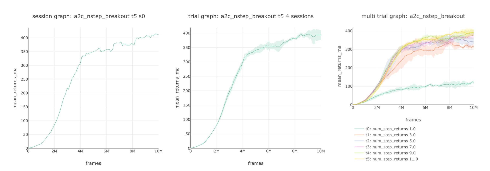

# Lab Organization

## 📂 Session, Trial, and Experiment

SLM Lab is organized in the following hierarchy:

* **Session:** The lowest level of SLM Lab: a single training run of one agent on one environment with one set of hyperparameters, all with a fixed random seed.
* **Trial:** A trial consists of multiple Sessions, with the Sessions varying only in the random seed.
* **Experiment:** Generates different sets of hyperparameters \(according to a spec file\) and runs a Trial for each one. It can be thought of as a study, e.g. “What values of n of A2C n-step returns provide the fastest, most stable solution, if the other variables are held constant?”

When using the lab command, different lab modes also correspond to different lab level:

* **enjoy**: Session
* **dev, train**: Trial
* **search**: Experiment

SLM Lab automatically produces plots for Sessions, Trials, and Experiments for any combination of environments and algorithms. It also logs and tracks metrics during training such as rewards, loss, exploration and entropy variables, model weights and biases, action distributions, frames-per-second and wall-clock time. The metrics are also visualized using TensorBoard.

Hyperparameter search is implemented using Ray Tune, and the results are automatically analyzed and presented hierarchically in increasingly granular detail.

## 🔁 Reproducibility Design

SLM Lab is designed for reproducible deep RL. It achieves this by using two simple components:

* **spec file** which defines the spec - fully exposed hyperparameters organized logically by the components
* **git SHA** that is saved with a spec file to specify the version of the code used to run it

In SLM Lab, every configurable hyperparameter for an algorithm is specified in a spec file. When the lab runs, it saves the spec file along with the git SHA as part of its output. This contains all the information required to reproduce a Session, Trial, or Experiment.


This implies that reproducing the entirety of an RL experiment merely requires checking out the code at the **git SHA** and running the saved **spec file**.


Next, we will go through a series of tutorials to learn the various use cases of SLM Lab.

