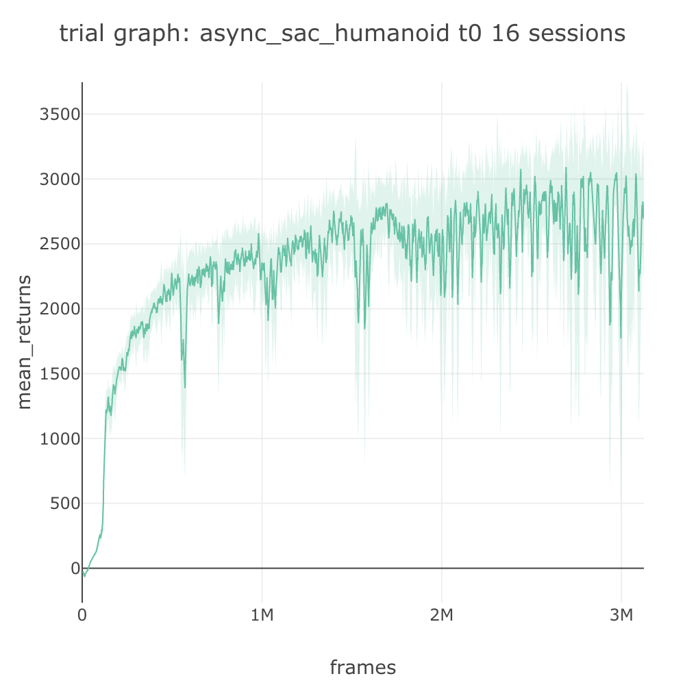
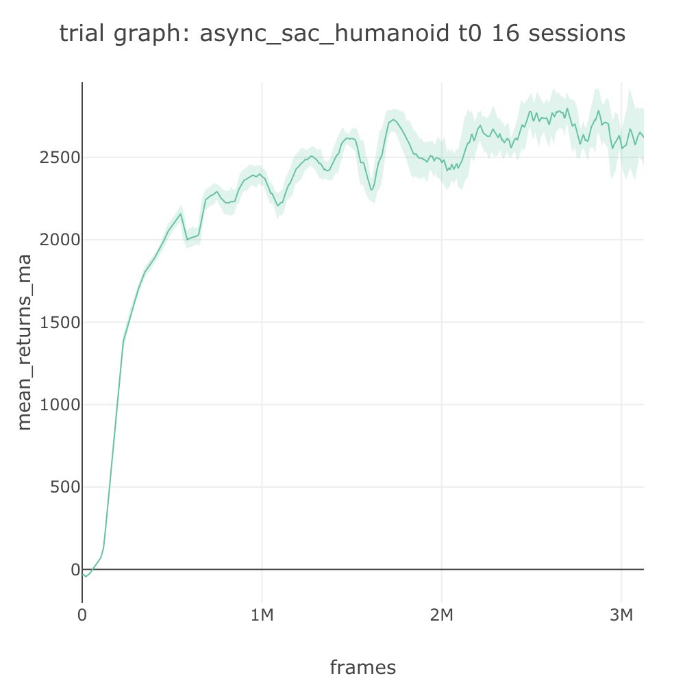

# Parallelizing Training: Async SAC on Humanoid

## Parallelizing Network Training with Hogwild!

This tutorial looks at a technique for parallelizing network training.

Earlier in [Environment Spec: A2C on Pong](environment-spec-a2c-on-bipedalwalker.md#env-spec-for-atari-pong) we learned that environments can be parallelized using vectorized environments. This can be useful especially when stepping the environment is a speed bottleneck., which is usually the case in on-policy algorithms like A2C and PPO.

On the other hand, when our run time is bottlenecked by the training speed of the networks of an algorithm, it is a good idea to parallelize network training. One popular method to do so is asynchronous parallelization using [Hogwild!](https://arxiv.org/abs/1106.5730) Parallelization of network training seem daunting in most cases since it may require complex infrastructure like parameter server and distributed computing.

Fortunately, there is an extremely simple way to use [Hogwild! in PyTorch](https://pytorch.org/docs/stable/notes/multiprocessing.html) using native multiprocessing and memory-sharing, if the process is contained within a single machine. This fits the scale of most deep RL experiments in SLM Lab, thus we have implemented it as part of the standard API so that all algorithms implemented can easily be trained in parallel.

This is [done by leveraging](https://github.com/kengz/SLM-Lab/blob/master/slm_lab/experiment/control.py#L137) the Trial-Sessions infrastructure of SLM Lab. When parallelization is enabled, SLM Lab Trial will create a Session and [set the agent networks in it as global networks](https://github.com/kengz/SLM-Lab/blob/master/slm_lab/experiment/control.py#L161). Then, it simply runs the Trial with a simple tweak – by [letting Sessions share global networks](https://github.com/kengz/SLM-Lab/blob/master/slm_lab/experiment/control.py#L167). Effectively, Sessions function as asynchronous workers, and everything else runs as usual.

## 📂 Meta Spec for Parallelizing Training

Like all the features in SLM Lab, Hogwild! can be activated by specifying it in the spec file. Since this feature is above Sessions, it fits within the **meta spec** reserved for higher level configurations.

```javascript
{
  "{spec_name}": {
    "agent": [{...}],
    "env": [{...}],
    ...
    "meta": {
      // Parameter for Trial.run(), to enable network sharing in memory among Sessions.
      // - false: disable Hogwild!
      // - "shared": enable Hogwild!, share parameters all the time
      // - "synced": enabled Hogwild!, sync parameters only after training step
      "distributed": str|bool,
      ...
    }
  }
}
```

[Hogwild! can be enabled with two modes](https://pytorch.org/docs/stable/notes/multiprocessing.html#asynchronous-multiprocess-training-e-g-hogwild):

* **"shared"**: sharing the network parameters all the time. This is useful and all Sessions can access the latest global network parameters whenever they are updated.
* **"synced"**: periodically synchronize the network parameters. This is useful when we need a on-policy guarantee when training on-policy algorithms.


Hogwild! also works when training with GPU. See an example [A3C spec here](https://github.com/kengz/SLM-Lab/blob/master/slm_lab/spec/benchmark/a3c/a3c_gae_pong.json).


## ✍ Meta Spec for Async SAC

SAC \(Soft Actor Critic\) is a sample efficient and off-policy algorithm. However it is very slow to train, since it consists of a policy network and 2 Q-networks. As a result, although reaching a particular performance at a task takes less number of frames, it can take longer in terms of wall clock time.

This makes SAC a good use case for applying parallelization to, i.e. creating an asynchronous variant of it – **Async SAC**. As an example, let's look at an example spec from [slm\_lab/spec/benchmark/async\_sac/async\_sac\_roboschool.json](https://github.com/kengz/SLM-Lab/blob/master/slm_lab/spec/benchmark/async_sac/async_sac_roboschool.json).


```javascript
{
  "async_sac_humanoid": {
    "agent": [{
      "name": "SoftActorCritic",
      "algorithm": {
        "name": "SoftActorCritic",
        "action_pdtype": "default",
        "action_policy": "default",
        "gamma": 0.99,
        "training_frequency": 1
      },
      ...
      }
    }],
    "env": [{
      "name": "RoboschoolHumanoid-v1",
      "num_envs": 8,
      "max_t": null,
      "max_frame": 5e7
    }],
    ...
    "meta": {
      "distributed": "shared",
      "log_frequency": 1000,
      "eval_frequency": 1000,
      "rigorous_eval": 0,
      "max_session": 16,
      "max_trial": 1
    }
  }
}
```


Humanoid is a difficult robotic control task that requires many samples to train on for most algorithms, hence it is standard to evaluate it on 50 million frames. If run without parallelization on SAC, this would take a month to complete a single session. By parallelizing \(**"distributed": "shared"**\) with 16 sessions \(**"max\_sessions": 16**\) as given in the meta spec above,  this reduces the run time by x16, so it will complete in 2 days.

## 🚀 Running Async SAC on Humanoid

Let's run a Trial using the spec file above:

```bash
python run_lab.py slm_lab/spec/benchmark/async_sac/async_sac_roboschool.json async_sac_humanoid
```

This trial will take about 2 days to complete, but due to SAC's sample efficiency, we should be above to observe the rewards climbing rapidly to above 1000 within 10 million frames \(10 / 16 million frames when counted on Session's individual frames\). As usual, when the trial completes, we will be able to see a trial graph similar to the one below:



We can also smoothen the trial graph by plotting its moving average over a window of 100 to obtain the graph below.



Note that the trial graph is generated as usual by taking an average of the sessions, but since sessions share networks their performance are very close, hence the small error envelope. Additionally, the horizontal axis is the frame count per individual session, hence to get the global frame count we need to rescale the axis by the number of sessions, which is 16 in this case, but we will not do so here to keep this tutorial simple.

To see how Async SAC compares with the other algorithms \(with the global frame count adjustment\), check out [Continuous Benchmark](../benchmark-results/continuous-benchmark.md).

