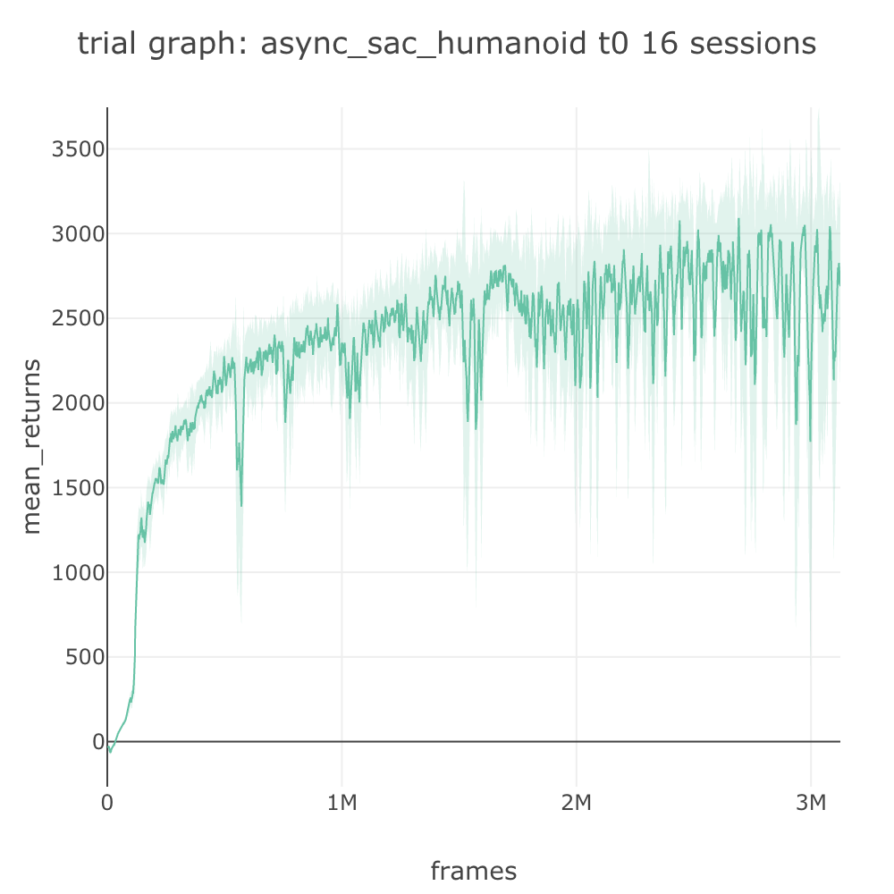
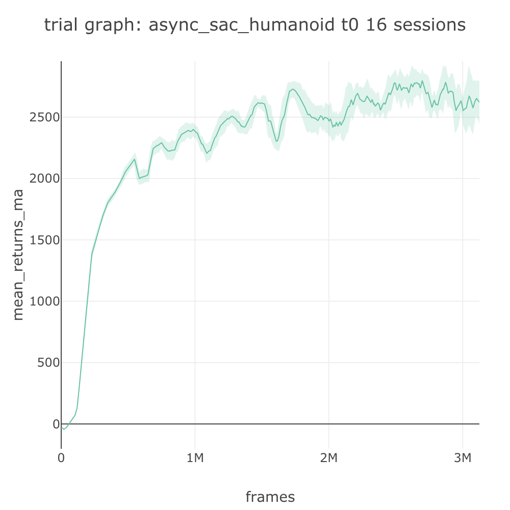

# Parallelizing Training: Async SAC on Humanoid ⚡


**v5 Status**: Async algorithms (A3C, Async SAC, DPPO) have not been re-validated in v5. The synchronous versions (SAC, PPO) are fully validated—see [Benchmark Results](../benchmark-results/continuous-benchmark.md). This tutorial documents the async architecture for reference; re-validation is pending.


## Parallelizing Network Training with Hogwild!

This tutorial covers a technique for parallelizing network training when the network computation—not environment stepping—is the bottleneck.

In [Environment Spec: A2C on Pong](environment-spec-a2c-on-bipedalwalker.md#env-spec-for-atari-pong), we saw that environments can be parallelized using vectorized environments. This speeds up on-policy algorithms (A2C, PPO) where environment stepping is the bottleneck.

Off-policy algorithms like SAC have a different bottleneck: network training. SAC maintains a policy network and two Q-networks, making each training step relatively slow. Asynchronous parallelization using [Hogwild!](https://arxiv.org/abs/1106.5730) can help here.

SLM Lab implements Hogwild! using [PyTorch's native multiprocessing](https://pytorch.org/docs/stable/notes/multiprocessing.html) with shared memory. When enabled, Sessions function as asynchronous workers sharing the same network parameters.

## Meta Spec for Parallelization

Enable Hogwild! in the **meta spec**:

```javascript
{
  "spec_name": {
    "agent": {...},
    "env": {...},
    "meta": {
      // Network sharing mode:
      // - false: disabled
      // - "shared": share parameters continuously
      // - "synced": sync after each training step
      "distributed": "shared",
      "max_session": 16,
      ...
    }
  }
}
```

Two modes are available:

* **"shared"**: Parameters shared continuously. Sessions see the latest weights whenever they're updated.
* **"synced"**: Parameters synchronized after training steps. Provides on-policy guarantees for algorithms that need them.


Hogwild! works with GPU training. See the [A3C spec](https://github.com/kengz/SLM-Lab/blob/master/slm_lab/spec/benchmark/a3c/a3c_gae_pong.json) for an example.


## Async SAC on Humanoid

[**Humanoid-v5**](https://gymnasium.farama.org/environments/mujoco/humanoid/) is one of the most challenging MuJoCo environments—a 17-joint humanoid robot must learn to walk. It has a 376-dimensional observation space and 17-dimensional continuous action space.


**v5 Note:** Gymnasium MuJoCo v5 environments have updated physics and reward functions. Humanoid-v5 is significantly harder than v4, with lower typical scores. See [Gymnasium MuJoCo docs](https://gymnasium.farama.org/environments/mujoco/) for details.


SAC is sample-efficient but slow to train due to its multiple networks. Humanoid requires ~50 million frames for good performance—without parallelization, this takes weeks.

The async SAC spec at [slm\_lab/spec/benchmark/async\_sac/async\_sac\_mujoco.json](https://github.com/kengz/SLM-Lab/blob/master/slm_lab/spec/benchmark/async_sac/async_sac_mujoco.json) shows this pattern:


```javascript
{
  "async_sac_humanoid": {
    "agent": {
      "name": "SoftActorCritic",
      "algorithm": {
        "name": "SoftActorCritic",
        "gamma": 0.99,
        "training_frequency": 1
      },
      "memory": {
        "name": "Replay",
        "batch_size": 256,
        "max_size": 200000,
        "use_cer": true
      },
      "net": {
        "type": "MLPNet",
        "hid_layers": [256, 256],
        "optim_spec": {
          "name": "GlobalAdam",
          "lr": 5e-05
        },
        "gpu": "auto"
      }
    },
    "env": {
      "name": "Humanoid-v5",
      "num_envs": 8,
      "max_frame": 5e7
    },
    "meta": {
      "distributed": "shared",
      "max_session": 16,
      "max_trial": 1
    }
  }
}
```


Key settings:

* **"distributed": "shared"** enables Hogwild! with continuous parameter sharing
* **"max_session": 16** runs 16 parallel workers
* **GlobalAdam** optimizer handles shared parameters across processes

With 16 parallel sessions, a 50M frame run completes in days rather than weeks.

## Running Async SAC

```bash
slm-lab run slm_lab/spec/benchmark/async_sac/async_sac_mujoco.json async_sac_humanoid train
```

The trial graph shows rewards climbing past 1000 within 10M frames (measured per-session). Since sessions share networks, their performance is nearly identical—hence the small error envelope.

These graphs are from v4 async SAC training (pending v5 re-validation):





For validated Humanoid results using synchronous PPO, see [Continuous Benchmark](../benchmark-results/continuous-benchmark.md)—PPO achieves **3774** on Humanoid-v5.


The x-axis shows per-session frames. To get total frames, multiply by number of sessions (16 here).


For benchmark comparisons, see [Continuous Benchmark](../benchmark-results/continuous-benchmark.md).
