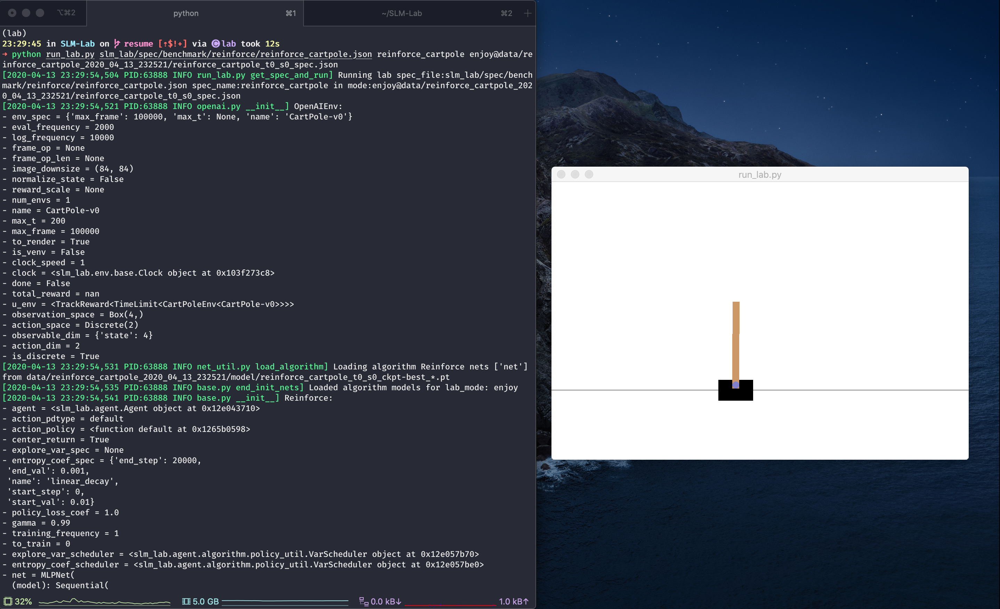

# Resume and Enjoy: REINFORCE CartPole

## ⏯ Train@ \(Resume\) Mode

The train mode can also resume training using the syntax `train@{predir}`as shown in [Lab Command](slm-lab-command.md#the-lab-modes), where `{predir}` is the data directory of a previous training run, e.g. `data/reinforce_cartpole_2020_04_13_232521`. A shorthand `train@latest` can also be used to automatically pick up from the latest training run to resume.

Using the same spec [from earlier](train-and-enjoy-dqn-cartpole.md), we can resume training with an example below:

```bash
python run_lab.py slm_lab/spec/benchmark/reinforce/reinforce_cartpole.json reinforce_cartpole train
# terminate run before its completion
# optionally edit the spec file in a past-future-consistent manner

# run resume with either of the commands:
python run_lab.py slm_lab/spec/benchmark/reinforce/reinforce_cartpole.json reinforce_cartpole train@latest
# or to use a specific run folder
python run_lab.py slm_lab/spec/benchmark/reinforce/reinforce_cartpole.json reinforce_cartpole train@data/reinforce_cartpole_2020_04_13_232521
```

### How Resume Works

The `train@` mode resumes a training in a _past-future-consistent_ manner, as explained below.

Suppose we run a training with 10 million \(10M\) frames to completion, and see that further improvements may be possible if we had run it for longer, say 20M frames. If only we could go back in time and set the frames to 20M to begin with.

The resume mode allows us to do that without time traveling. We can edit the spec file in the present and resume training so the run picks up where it left off as if it was already using the edited spec. Of course, the modification to the spec file must itself be consistent to the past and the future, e.g. we cannot suddenly modify the initial learning rate or variable values.

To achieve this, the lab relies on 3 objects and their `load` methods

* `algorithm.load()`: this already loads the algorithm and their model weights for enjoy mode, now it's used for `train@` mode
* `body.train_df`: this object tracks the training metrics data, hence needs to be loaded
* `env.clock`: this tracks the time within the session.

Since everything in the lab runs according to `env.clock`, the above are all we need to restore for resuming training. Once the network and training metrics are restored, and the clock is set correctly, everything runs from the designated point in time.


For off-policy algorithms the replay memory is not restored simply due to the cost of storing replay data \(GBs of data per session and slow write during frequent checkpoints\). Hence the behavior of off-policy replay is slightly different: it will need to fill up again from resume-point and training will only start again at the specified replay size threshold, so we will lose a small fraction of the total timesteps.


## ▶ Enjoy Mode

Enjoy mode runs a trained model from a session using its spec file, as reflected in the lab mode syntax `enjoy@{session_spec_file}` ****shown in [Lab Command](slm-lab-command.md#the-lab-modes). The spec file for the session was saved automatically when it ran. The lab automatically finds and loads the model weights, which are saved in the model folder, e.g. `data/reinforce_cartpole_2020_04_13_232521/model/`.

For our example, let's use trial 0 session 0, so the `session_spec_file` is `data/reinforce_cartpole_2020_04_13_232521/reinforce_cartpole_t0_s0_spec.json`. To run enjoy mode, use the following command:

```bash
python run_lab.py slm_lab/spec/benchmark/reinforce/reinforce_cartpole.json reinforce_cartpole enjoy@data/reinforce_cartpole_2020_04_13_232521/reinforce_cartpole_t0_s0_spec.json
```

This will create a new Session by loading the saved spec file from a past session and its **best** model, indicated by the suffix `_ckpt-best` in the model files. These files are saved from the best evaluation checkpoints \(determined by `total_reward_ma`\).

Enjoy mode will also render the environment like we saw in [Quick Start](../setup/quick-start.md), but only this time the REINFORCE agent which has the trained weights loaded will perform well immediately.

We can see this in the terminal from the logged metrics, with `total_reward_ma` starting at 200 \(the maximum score\) immediately:



In the next tutorial, we will dive into the spec file for an agent.

