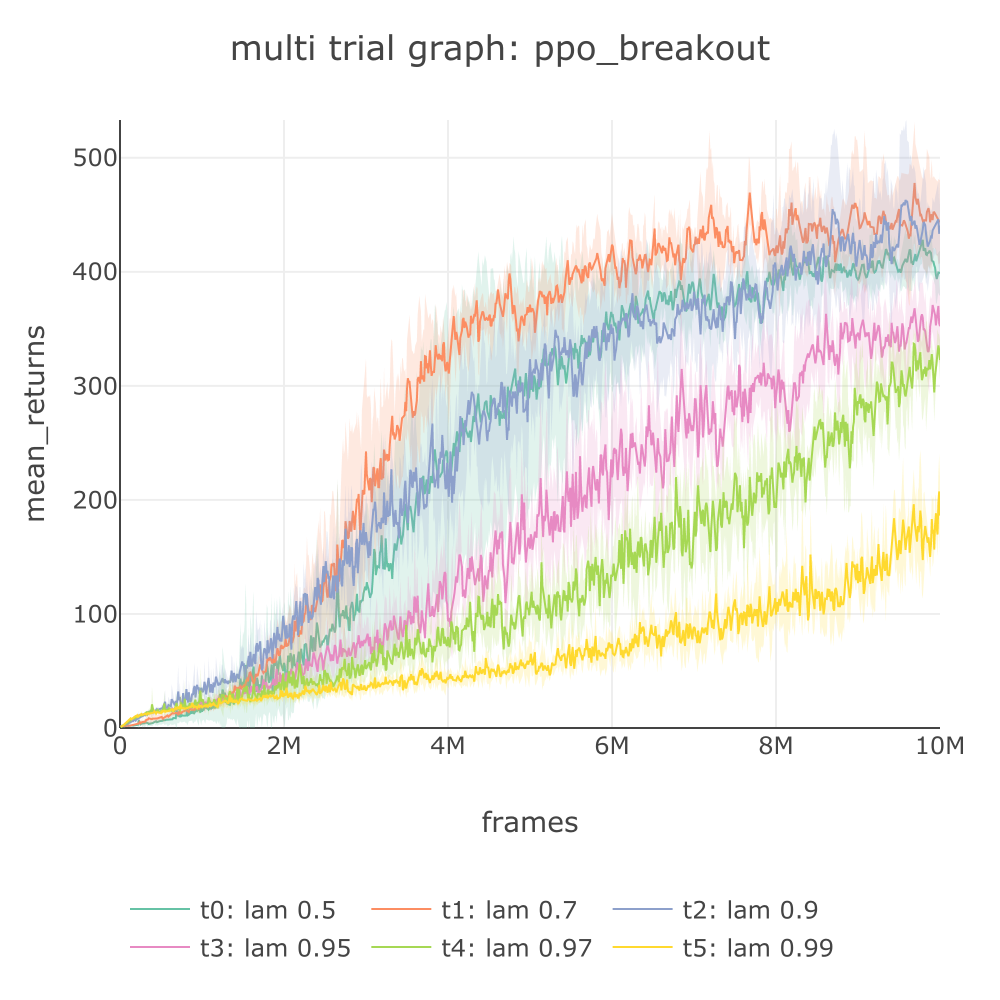
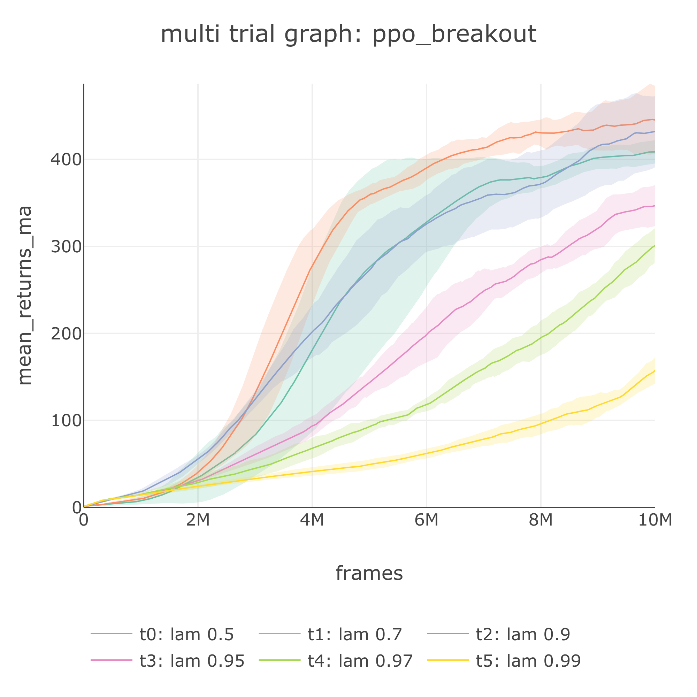

# Hyperparameter Search with ASHA

## Overview

SLM Lab v5 uses [Ray Tune](https://docs.ray.io/en/latest/tune/index.html) with ASHA (Asynchronous Successive Halving Algorithm) for efficient hyperparameter search. ASHA terminates underperforming trials early, focusing compute on promising configurations.

In this tutorial, we'll search for optimal lambda values for PPO on Breakout.

## Search Syntax

Add a **search** section to your spec with `{key}__{space_type}` syntax:

```javascript
{
  "spec_name": {
    "agent": {...},
    "env": {...},
    "meta": {
      "max_session": 1,
      "max_trial": 16,
      "search_scheduler": {
        "grace_period": 100000,
        "reduction_factor": 3
      }
    },
    "search": {
      "agent.algorithm.gamma__uniform": [0.95, 0.999],
      "agent.net.optim_spec.lr__loguniform": [1e-5, 1e-3]
    }
  }
}
```

### Search Space Types

| space\_type | value | description |
|-------------|-------|-------------|
| choice | `[v1, v2, ...]` | Sample from list |
| uniform | `[low, high]` | Uniform distribution |
| loguniform | `[low, high]` | Log-uniform distribution |
| randint | `[low, high]` | Random integer |
| grid\_search | `[v1, v2, ...]` | Exhaustive grid (multiplies trials) |

Examples:
* `"gamma__choice": [0.9, 0.99, 0.999]` - sample from list
* `"lr__loguniform": [1e-5, 1e-3]` - log-uniform between values
* `"lam__grid_search": [0.9, 0.95, 0.99]` - run all values (3x trials)

## ASHA Early Stopping

The key v5 feature for efficient search. Add `search_scheduler` to your meta spec:

```javascript
{
  "meta": {
    "max_session": 1,
    "max_trial": 16,
    "search_resources": {"cpu": 1, "gpu": 0.125},
    "search_scheduler": {
      "grace_period": 100000,
      "reduction_factor": 3
    }
  }
}
```

**Key settings:**

* **max_session: 1** - Single session per trial (required for ASHA to compare fairly)
* **max_trial: 16** - Total trials to run
* **grace_period** - Minimum frames before first evaluation (allow learning to start)
* **reduction_factor: 3** - Keep top 1/3 of trials at each rung

ASHA evaluates trials at checkpoints and terminates the bottom 2/3, focusing resources on promising runs. A 16-trial search might only run 5-6 trials to completion.


**Search budget rule:** ~3-4 trials per search dimension minimum. 8 trials = 2-3 dims, 16 trials = 3-4 dims, 20+ trials = 5+ dims.


## Three-Stage Search Process

For robust hyperparameter tuning, use this workflow:

| Stage | Mode | Config | Purpose |
|-------|------|--------|---------|
| ASHA | `search` | `max_session=1`, `search_scheduler` | Wide exploration |
| Multi | `search` | `max_session=4`, no scheduler | Validate top configs |
| Final | `train` | Best hyperparameters | Confirmation run |

1. **ASHA stage**: Quick exploration across many configurations
2. **Multi stage**: Run top 3-5 configs with multiple seeds (no early stopping)
3. **Final stage**: Update spec defaults with best hyperparameters

## Example: PPO Lambda Search

From [slm\_lab/spec/experimental/ppo/ppo\_lam\_search.json](https://github.com/kengz/SLM-Lab/blob/master/slm_lab/spec/experimental/ppo/ppo_lam_search.json):


```javascript
{
  "ppo_breakout": {
    "agent": {
      "name": "PPO",
      "algorithm": {
        "name": "PPO",
        "gamma": 0.99,
        "lam": 0.7,
        "time_horizon": 128,
        "minibatch_size": 256,
        "training_epoch": 4
      },
      "memory": {"name": "OnPolicyBatchReplay"},
      "net": {
        "type": "ConvNet",
        "shared": true,
        "gpu": "auto"
      }
    },
    "env": {
      "name": "ALE/Breakout-v5",
      "num_envs": 16,
      "max_frame": 1e7
    },
    "meta": {
      "max_session": 1,
      "max_trial": 16,
      "log_frequency": 10000,
      "eval_frequency": 10000,
      "search_resources": {"cpu": 1, "gpu": 0.125},
      "search_scheduler": {
        "grace_period": 500000,
        "reduction_factor": 3
      }
    },
    "search": {
      "agent.algorithm.lam__choice": [0.5, 0.7, 0.85, 0.9, 0.95, 0.99]
    }
  }
}
```


## Running the Search

```bash
slm-lab run slm_lab/spec/experimental/ppo/ppo_lam_search.json ppo_breakout search
```

Ray Tune queues trials and runs them as resources free up. With `gpu: 0.125`, 8 trials run in parallel on a single GPU.

## Analyzing Results

Results are saved to `data/ppo_breakout_{ts}/` with:
* `experiment_df.csv` - all trial results, sorted best-first
* Per-trial subdirectories with session data

The experiment produces comparison graphs:






For full benchmarking methodology and results, see [docs/BENCHMARKS.md](https://github.com/kengz/SLM-Lab/blob/master/docs/BENCHMARKS.md).

