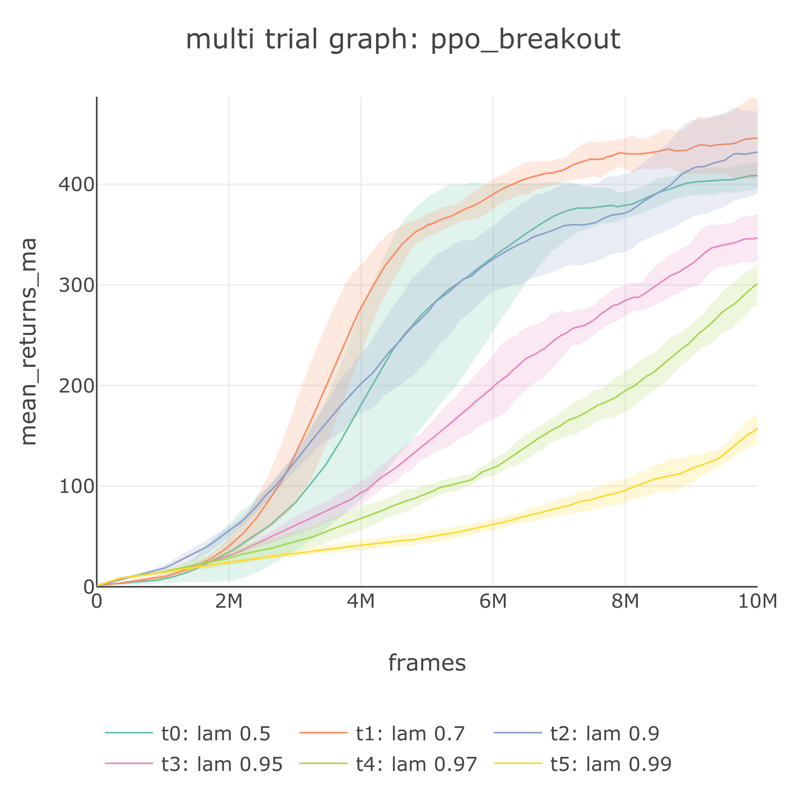

# Experiment and Search Spec: PPO on Breakout

## 📂The Search Spec

In this tutorial, we will learn how to run an experiment to study the following example question:

> What values of lambda of PPO provide the fastest, most stable solution for Atari Breakout, if the other variables are held constant?

In SLM Lab, we can easily run experiments to answer questions about deep RL. An **Experiment** in SLM Lab runs a number of Trials using a **search spec** by generating different sets of hyperparameters to search over \(using [Ray Tune](https://ray.readthedocs.io/en/latest/tune.html)\) and running a Trial for each one. 

The search spec has the following format:

```javascript
{
  "{spec_name}": {
    "agent": [{...}],
    "env": [{...}],
    ...
    "meta": {
      ...
      "max_trial": int,
    },
    "search": {
      *spec
    }
  }
}
```

That is, the **search spec** can contain any components of a spec file. To perform search over a spec variable, simply:

* mirror the spec for that variable
* append a search mode to the variable key
* define the config space for the search mode

Essentially, search spec [defines the config space](https://github.com/kengz/SLM-Lab/blob/master/slm_lab/experiment/search.py#L14) using `"{key}__{space_type}": {v}`, where `{space_type}` is `grid_search` of `ray.tune`, or any function name of `np.random`:

| space\_type | v | v type |
| :--- | :--- | :--- |
| grid\_search | `[value1, value2, ...]` |  `str|int|float` |
| choice | `[value1, value2, ...]` | `str|int|float` |
| randint | `[low, high)` | `int` |
| uniform | `[low, high)` | `float` |
| normal | `[low, high)` | `float` |

For example:

* `"explore_anneal_epi__randint": [10, 60]` will sample integers uniformly from 10 to 60 for `explore_anneal_epi`
* `"lr__uniform": [0.001, 0.1]` will sample `lr` using `np.random.uniform(0.001, 0.1)`

When constructing a new Trial, an Experiment samples an instance from the config space, then updates the original spec with the sampled values before passing it to the Trial constructor.

By default, an Experiment will run search for as many Trials as specified by **"max\_trial"** in meta spec using Random sampling from the full config space. If any key uses `grid_search`, it will be combined exhaustively in combination with other random sampling, e.g. for max\_trial = 1 with one grid search of 4 elements, this will yield 4 x 1 = 1 total trials.

## ✍ Search Spec for PPO

As an example, let's try to answer the question:

> What values of lambda of PPO provide the fastest, most stable solution for Atari Breakout, if the other variables are held constant?

Let's look at the search spec for PPO on Breakout from [slm\_lab/spec/experimental/ppo/ppo\_lam\_search.json](https://github.com/kengz/SLM-Lab/blob/master/slm_lab/spec/experimental/ppo/ppo_lam_search.json).


```javascript
{
  "ppo_breakout": {
    "agent": [{
      "name": "PPO",
      "algorithm": {
        "name": "PPO",
        "action_pdtype": "default",
        "action_policy": "default",
        "explore_var_spec": null,
        "gamma": 0.99,
        "lam": 0.70,
        ...
      },
      ...
    }],
    "env": [{
      "name": "BreakoutNoFrameskip-v4",
      "frame_op": "concat",
      "frame_op_len": 4,
      "reward_scale": "sign",
      "num_envs": 16,
      "max_t": null,
      "max_frame": 1e7
    }],
    ...
    "meta": {
      "distributed": false,
      "log_frequency": 10000,
      "eval_frequency": 10000,
      "max_session": 4,
      "max_trial": 1,
    },
    "search": {
      "agent": [{
        "algorithm": {
          "lam__grid_search": [0.50, 0.70, 0.90, 0.95, 0.97, 0.99]
        }
      }]
    }
  }
}
```


This file defines the spec for PPO and Breakout as usual. Corresponding to the question, we are interested in finding out the effect of different values of `agent[0].algorithm.lam`. The search spec specifies a grid search over it, and we set **"meta.max\_trial"** to 1 since we are only doing a grid search.

## 🚀 Running a PPO Search on Breakout

Let's run an Experiment using the spec file above by using the **search** lab mode:

```bash
python run_lab.py slm_lab/spec/experimental/ppo/ppo_lam_search.json ppo_breakout search
```

This will spawn 6 trials in queue using [Ray Tune](https://ray.readthedocs.io/en/latest/tune.html), which are then dequeued to run [as computing resources free up](https://github.com/kengz/SLM-Lab/blob/master/slm_lab/experiment/search.py#L46). Since we specify a trial to run 4 sessions, it will take up 4 CPUs and 4 GPUs. If we run this on a machine with 32 CPUs and 8 GPUs, the experiment will run 2 trials at any given time.

At the end of the experiment, we will obtain the usual trial graphs. Additionally, it will also produce an experiment graph, as shown below:


Just as how we can plot the moving average version of a trial graph, we can do the same for experiment graph:



From the experiment graph, we can observe that **trial 1** \(red\) with **lam: 0.7** performs the best on Breakout with the fastest convergence and the best final result.

