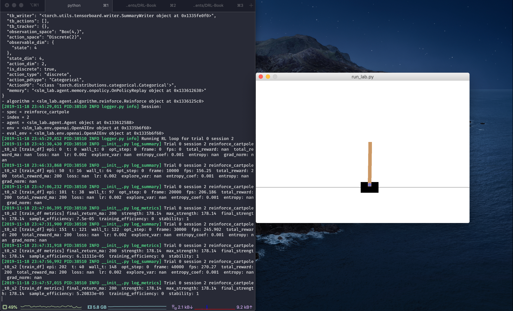

# Train and Enjoy: REINFORCE CartPole

## 🚀 Train Mode

This tutorial will look at how to train an agent in SLM Lab, then use the automatically-saved model files to replay it in enjoy mode, using REINFORCE on CartPole.

REINFORCE is a very basic policy gradient algorithm, and we are training it on an easy environment. We will use the spec file at [slm\_lab/spec/benchmark/reinforce/reinforce\_cartpole.json](https://github.com/kengz/SLM-Lab/blob/master/slm_lab/spec/benchmark/reinforce/reinforce_cartpole.json), in particular the **reinforce\_cartpole** spec, and run it in **train** mode. The lab command is:

```bash
python run_lab.py slm_lab/spec/benchmark/reinforce/reinforce_cartpole.json reinforce_cartpole train
```

This will run a `Trial` with 4 `Sessions` of different random seeds to average the results. Wait for it to run until completion, which should take about 10-20 minutes. Meanwhile, check the metrics logged in the terminal. In particular, the `total_reward` and its moving average `total_reward_ma` \(with a window of 100 episodes\) should climb up gradually.


REINFORCE successfully trains on CartPole when the `total_reward_ma` reaches close to the maximum of 200, although a score of over 100 will do for this tutorial.


When the trial completes, all the metrics, graphs and data will be saved to a timestamped folder, let's say `data/reinforce_cartpole_2019_11_18_233140/`. Among other things, SLM Lab also automatically saves the **final** and the **best** model files in the model folder. The model files can be used for easy playback in enjoy mode.

## ▶ Enjoy Mode

We now look inside the model folder at `data/reinforce_cartpole_2019_11_18_233140/model/`. According to [Lab Command](slm-lab-command.md#the-lab-modes) the enjoy mode in SLM Lab also needs the **prename**, which is the spec name with trial and session. Let's use trial 0 session 2, so our prename is `reinforce_cartpole_t0_s2`.

### Using the Final Checkpoint

The model files that corresponds to the **final** checkpoint is `reinforce_cartpole_t0_s2`. TO use this for enjoy mode, run the command using the saved spec file in the data folder, and the prename:

```bash
python run_lab.py data/reinforce_cartpole_2019_11_18_233140/reinforce_cartpole.json reinforce_cartpole enjoy@reinforce_cartpole_t0_s2
```

This will create a new Session by loading the saved spec file and the specified model. This will also render the environment like we saw in [Quick Start](../setup/quick-start.md), but only this time the REINFORCE agent which has the trained weights loaded will perform well immediately.

We can see this in the terminal from the logged metrics, with `total_reward_ma` starting at 200 \(the maximum score\) immediately:



### Using the Best Checkpoint

Inside the model folder there are also variants of the model files saved with a suffix **"ckpt-best"**. These files are saved from the best evaluation checkpoints \(determined by `total_reward_ma`\), and may or may not be equal to the final checkpoint. To run enjoy mode using them instead, simply supply the prename with "ckpt-best", like so:

```bash
python run_lab.py data/reinforce_cartpole_2019_11_18_233140/reinforce_cartpole.json reinforce_cartpole enjoy@reinforce_cartpole_t0_s2_ckpt-best
```

Loading the best checkpoint model is especially useful when an algorithm's performance deteriorates over time.

In the next tutorial, we will dive into the spec file for an agent.

